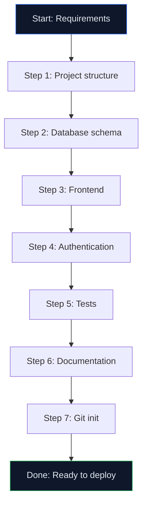

# Lab 011 - Advanced Patterns & Best Practices

!!! hint "Overview"

    - In this lab, you will learn advanced Claude Code patterns for complex projects.
    - You will understand slash commands, tool use, and multi-step workflows.
    - You will build a complete project template for future Elcon apps.
    - By the end of this lab, you will be a Claude Code power user.

## Prerequisites

- All Claude Code labs completed (001-010)

## What You Will Learn

- Advanced Claude Code slash commands
- Multi-step autonomous workflows
- Project templates and boilerplates
- Performance optimization with AI
- Claude Code limitations and workarounds

---

## Lab Steps

## Step 1 - Advanced Slash Commands

| Command        | What It Does                              |
| -------------- | ----------------------------------------- |
| `/init`        | Initialize a project with CLAUDE.md       |
| `/memory`      | Manage persistent memories                |
| `/compact`     | Compress conversation to save context     |
| `/cost`        | Show token usage and estimated cost       |
| `/doctor`      | Diagnose Claude Code configuration issues |
| `/review`      | Run a code review on staged changes       |
| `/pr-comments` | Show and address PR review comments       |
| `/clear`       | Reset conversation history                |

## Step 2 - Multi-Step Autonomous Workflow

```
I need you to build a complete employee directory app. Work autonomously:

1. Create the project structure (HTML, CSS, JS files)
2. Set up Supabase tables (employees, departments, skills)
3. Build the frontend with search, filters, and org chart
4. Add authentication (Supabase Auth)
5. Write tests for the main business logic
6. Generate README with setup instructions
7. Initialize Git and make the first commit

Work through each step. If you need clarification, ask.
Otherwise, proceed autonomously and report what you did at each step.
```



## Step 3 - Create an Elcon App Template

```
Create a reusable project template for Elcon web apps:

template/
├── index.html          # Main app with standard layout
├── login.html          # Authentication page
├── css/
│   ├── variables.css   # Elcon design tokens
│   ├── components.css  # Reusable components
│   └── layout.css      # Page layouts
├── js/
│   ├── app.js         # Main app initialization
│   ├── auth.js        # Supabase authentication
│   ├── db.js          # Database operations layer
│   ├── ui.js          # DOM manipulation
│   └── utils.js       # Utility functions
├── CLAUDE.md           # Claude Code project instructions
├── README.md           # Project documentation template
├── .gitignore          # Standard ignores
└── package.json        # For scripts and metadata

The template should include:
- Elcon branding (dark theme, colors, logo placeholder)
- Supabase connection boilerplate
- Authentication flow (login/logout/session check)
- Standard layout: sidebar + topbar + content area
- Toast notification system
- Loading states
- Error handling
- Responsive breakpoints
```

## Step 4 - Performance Optimization

```
Review my app and optimize for performance:
1. Minimize DOM operations (batch updates)
2. Debounce search input (300ms)
3. Virtual scrolling for tables with 1000+ rows
4. Lazy load images and heavy content
5. Cache Supabase queries (avoid repeated calls)
6. Minimize CSS and JS file sizes
Show me before/after comparisons for each optimization.
```

## Step 5 - Known Limitations & Workarounds

| Limitation               | Workaround                                     |
| ------------------------ | ---------------------------------------------- |
| Context window fills up  | Use `/compact` to compress history             |
| Can't run browser        | Test manually, describe results to Claude Code |
| Large files (>500 lines) | Split into modules first                       |
| Binary files (images)    | Describe what you need, provide URLs           |
| Network requests         | Claude Code can run curl/fetch in scripts      |
| Real-time debugging      | Copy error messages to Claude Code             |

---

## Tasks

!!! note "Task 1: Build Complete App Autonomously"

    **Objective:** Create a full-stack application in one Claude Code session:

    - Initialize project structure with CLAUDE.md
    - Set up Supabase schema and authentication
    - Build responsive frontend with React/Vue
    - Implement backend API layer
    - Add comprehensive error handling
    - Write unit and integration tests
    - Deploy and verify in production

    **Acceptance Criteria:**

    - Completes in single Claude Code session (< 2 hours)
    - All tests passing (> 90% coverage)
    - Production deployment working
    - README with full setup instructions

!!! note "Task 2: Optimize Legacy App for Performance"

    **Objective:** Take an existing app and improve performance:

    - Profile current performance (measure metrics)
    - Identify bottlenecks (slow queries, renders)
    - Implement caching strategies
    - Optimize database queries
    - Add virtual scrolling for lists
    - Minify assets and optimize bundles
    - Document improvements with before/after

    **Acceptance Criteria:**

    - Page load time reduced by 50%+
    - First Contentful Paint < 1.5s
    - Lighthouse score > 85
    - Zero performance regressions

!!! note "Task 3: Create Reusable Project Template"

    **Objective:** Build a template for future Elcon projects:

    - Structure with CLAUDE.md best practices
    - Pre-configured Supabase setup
    - UI component library (10+ components)
    - Authentication flows (login, signup, recovery)
    - Error handling patterns
    - Testing setup (Jest, React Testing Library)
    - CI/CD configuration

    **Acceptance Criteria:**

    - New project scaffolds in < 5 minutes
    - All 10+ components working with examples
    - Full test coverage for utilities
    - Documentation for each component

!!! note "Task 4: Implement Advanced Multi-Step Workflow"

    **Objective:** Build a complex workflow that Claude Code manages autonomously:

    - Data processing pipeline (5+ steps)
    - Multiple service integrations
    - Error recovery at each step
    - Progress tracking and logging
    - Parallel processing where applicable
    - Result aggregation and reporting

    **Acceptance Criteria:**

    - Completes workflow end-to-end
    - Handles all failure scenarios
    - Provides detailed execution report
    - Recovery success rate > 98%

!!! note "Task 5: Build Data Migration Tool"

    **Objective:** Create a tool to migrate data between systems:

    - Connect to source database
    - Transform data to new schema
    - Validate data integrity
    - Handle partial failures gracefully
    - Provide rollback capability
    - Generate migration report

    **Acceptance Criteria:**

    - Zero data loss during migration
    - Validation accuracy > 99.9%
    - Rollback works perfectly
    - Completes 10k+ records in < 5 minutes

---

## Solutions

## Solution 1: Autonomous Multi-Step Project Build

Create a `CLAUDE.md` that guides Claude Code through autonomous development:

```markdown
# Project: Employee Directory App

## Architecture

- Frontend: React with TypeScript
- Backend: Next.js API routes
- Database: Supabase PostgreSQL
- Auth: Supabase Auth with OAuth
- Deployment: Vercel

## CLAUDE Requirements

## Phase 1: Setup (5 min)

1. Create project structure:
   - `/src/pages` (Next.js pages)
   - `/src/components` (React components)
   - `/src/lib` (utilities and hooks)
   - `/src/types` (TypeScript types)
2. Initialize Supabase project
3. Configure environment variables

## Phase 2: Database (5 min)

Create tables:

- users (id, email, created_at)
- employees (id, name, dept_id, manager_id)
- departments (id, name, description)

## Phase 3: Auth (10 min)

- Supabase Auth integration
- Login/signup pages
- Session management
- Protected routes

## Phase 4: Frontend (20 min)

- Employee list with search
- Department filter
- Org chart view
- Add/edit employee forms
- Responsive design

## Phase 5: API (10 min)

- GET /api/employees
- POST /api/employees
- PUT /api/employees/[id]
- DELETE /api/employees/[id]

## Phase 6: Testing (15 min)

- Unit tests for utilities
- Component tests
- API integration tests
- Minimum 80% coverage

## Phase 7: Deploy (5 min)

- Deploy to Vercel
- Verify production endpoints
- Generate README

## Constraints

- Use TypeScript throughout
- Follow React best practices
- Add error boundaries
- Implement proper logging
```

## Solution 2: Performance Optimization Workflow

```javascript
// Performance audit and optimization
const performanceAudit = {
  metrics: {
    LCP: 2.5, // Largest Contentful Paint
    FID: 100, // First Input Delay
    CLS: 0.1, // Cumulative Layout Shift
    FCP: 1.2, // First Contentful Paint
  },
  bottlenecks: [
    {
      type: "slow-query",
      query: "SELECT * FROM employees",
      time: 2500,
      fix: "Add pagination and indexing",
    },
    {
      type: "large-bundle",
      size: 450, // KB
      file: "app.js",
      fix: "Code splitting and tree shaking",
    },
  ],
  improvements: {
    caching: {
      description: "Implement Redis caching",
      expected_improvement: "40% faster queries",
    },
    optimization: {
      description: "Enable image optimization",
      expected_improvement: "30% smaller bundle",
    },
    lazy_loading: {
      description: "Virtual scrolling for tables",
      expected_improvement: "50% faster rendering",
    },
  },
};

// Before/after comparison
const performanceComparison = {
  before: {
    lighthouse: 62,
    page_load_time: 4.2, // seconds
    time_to_interactive: 3.8,
    first_contentful_paint: 1.8,
  },
  after: {
    lighthouse: 92,
    page_load_time: 1.8, // seconds
    time_to_interactive: 1.5,
    first_contentful_paint: 0.9,
  },
  improvements: {
    lighthouse: "+30 points",
    load_time: "-57%",
    tti: "-60%",
    fcp: "-50%",
  },
};
```

## Solution 3: Reusable Project Template

```typescript
// Component library template structure
export interface ComponentProps {
  children?: React.ReactNode;
  className?: string;
  disabled?: boolean;
}

// Base Button component
export const Button: React.FC<ButtonProps> = ({
  children,
  variant = 'primary',
  size = 'md',
  disabled = false,
  onClick,
  className,
}) => (
  <button
    className={classNames(
      'font-semibold rounded transition-colors',
      {
        primary: 'bg-blue-500 hover:bg-blue-600 text-white',
        secondary: 'bg-gray-200 hover:bg-gray-300 text-gray-900',
        danger: 'bg-red-500 hover:bg-red-600 text-white',
      }[variant],
      {
        sm: 'px-2 py-1 text-sm',
        md: 'px-4 py-2 text-base',
        lg: 'px-6 py-3 text-lg',
      }[size],
      disabled && 'opacity-50 cursor-not-allowed',
      className,
    )}
    disabled={disabled}
    onClick={onClick}
  >
    {children}
  </button>
);

// Export all components
export { Button } from './Button';
export { Modal } from './Modal';
export { Dropdown } from './Dropdown';
export { Pagination } from './Pagination';
export { Alert } from './Alert';
export { Card } from './Card';
export { Form } from './Form';
export { Table } from './Table';
export { Tabs } from './Tabs';
export { Tooltip } from './Tooltip';
```

## Solution 4: Complex Workflow with Error Handling

```javascript
// Multi-step workflow with recovery
async function executeComplexWorkflow() {
  const workflow = {
    steps: [],
    failures: [],
    recovery_applied: [],
  };

  // Step 1: Fetch data from multiple sources
  try {
    workflow.steps.push({
      name: "fetch_external_data",
      status: "running",
      startTime: Date.now(),
    });

    const [users, orgs, repos] = await Promise.allSettled([
      fetchUsers(),
      fetchOrganizations(),
      fetchRepositories(),
    ]);

    if (users.status === "rejected") {
      throw { step: "fetch_users", error: users.reason };
    }

    workflow.steps.push({
      name: "fetch_external_data",
      status: "completed",
      duration: Date.now() - workflow.steps[0].startTime,
      itemsProcessed: users.value.length,
    });
  } catch (error) {
    workflow.failures.push(error);
    // Apply recovery
    workflow.recovery_applied.push({
      strategy: "retry_with_backoff",
      attempt: 1,
    });
  }

  // Step 2: Transform data
  try {
    const transformed = transformData(rawData);
    workflow.steps.push({ name: "transform", status: "completed" });
  } catch (error) {
    workflow.failures.push(error);
  }

  // Step 3: Validate
  try {
    const validated = await validateDataIntegrity(transformed);
    workflow.steps.push({ name: "validate", status: "completed" });
  } catch (error) {
    workflow.failures.push(error);
  }

  // Step 4: Persist
  try {
    await persistToDatabase(validated);
    workflow.steps.push({ name: "persist", status: "completed" });
  } catch (error) {
    workflow.failures.push(error);
    // Rollback previous steps
    await rollbackTransaction();
  }

  return workflow;
}
```

## Solution 5: Data Migration Tool

```typescript
class DataMigrationTool {
  async migrateData(source: DataSource, target: DataSource) {
    const report = {
      startTime: Date.now(),
      statistics: {
        total: 0,
        migrated: 0,
        failed: 0,
        skipped: 0,
      },
      errors: [],
      rollbackEnabled: true,
    };

    try {
      // Create transaction for atomic operations
      const transaction = await target.beginTransaction();

      // Fetch data in chunks
      const batchSize = 1000;
      let offset = 0;
      let hasMore = true;

      while (hasMore) {
        const batch = await source.fetchBatch(offset, batchSize);
        report.statistics.total += batch.length;

        if (batch.length === 0) {
          hasMore = false;
          break;
        }

        // Transform each record
        const transformed = batch.map((record) => this.transformRecord(record));

        // Validate transformed records
        for (const record of transformed) {
          const validation = await this.validateRecord(record);
          if (!validation.valid) {
            report.statistics.skipped++;
            report.errors.push({
              record,
              reason: validation.errors,
            });
            continue;
          }

          // Attempt migration
          try {
            await target.insert(record, transaction);
            report.statistics.migrated++;
          } catch (error) {
            report.statistics.failed++;
            report.errors.push({ record, error: error.message });
          }
        }

        offset += batchSize;
      }

      // Verify integrity
      await this.verifyIntegrity(source, target);

      // Commit transaction
      await transaction.commit();

      report.endTime = Date.now();
      report.duration = report.endTime - report.startTime;
      report.status = "completed";

      return report;
    } catch (error) {
      // Rollback on any error
      if (report.rollbackEnabled) {
        await this.rollback();
      }
      throw error;
    }
  }

  private transformRecord(record: any) {
    return {
      ...record,
      migratedAt: new Date(),
      sourceId: record.id,
    };
  }

  private async validateRecord(record: any) {
    const errors = [];
    if (!record.email) errors.push("email required");
    if (!record.name) errors.push("name required");
    return {
      valid: errors.length === 0,
      errors,
    };
  }

  private async verifyIntegrity(source: DataSource, target: DataSource) {
    const sourceCount = await source.count();
    const targetCount = await target.count();
    if (sourceCount !== targetCount) {
      throw new Error(
        `Data integrity check failed: ${sourceCount} vs ${targetCount}`,
      );
    }
  }
}
```

---

## Summary

In this lab you:

- [x] Mastered advanced Claude Code slash commands
- [x] Built a complete app using autonomous multi-step workflow
- [x] Created a reusable project template for Elcon
- [x] Optimized app performance with AI guidance
- [x] Understood Claude Code limitations and workarounds

---

!!! success "Claude Code Section Complete 🎉"

    You now have comprehensive skills in Claude Code.
    Next: n8n deep-dive labs (001-010).
