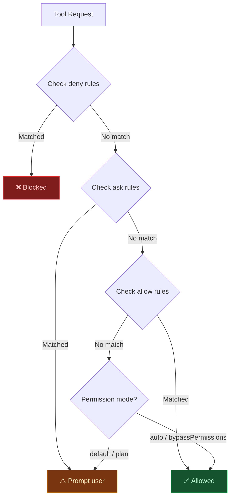
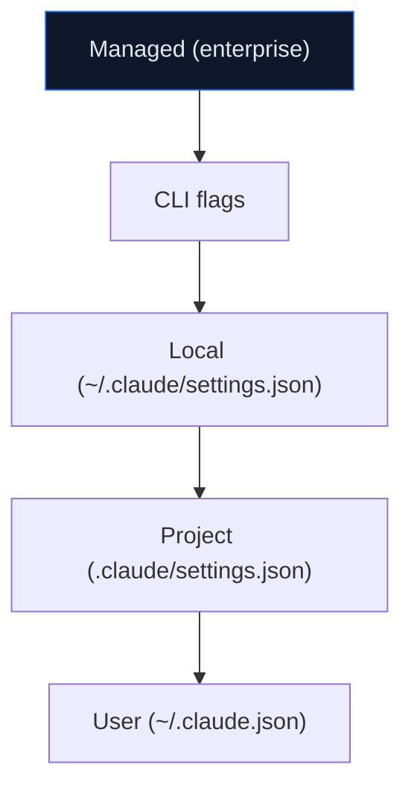

# Lab 012 - Permission Modes & Security

!!! hint "Overview"

    - In this lab, you will learn how Claude Code's 6 permission modes control what the agent can do.
    - You will configure permission rules to allow, ask, or deny specific tools and patterns.
    - You will understand the settings hierarchy and how managed policies override local ones.
    - You will secure an Elcon project by restricting access to sensitive files and commands.
    - By the end of this lab, you will have a locked-down Claude Code configuration for production work.

## Prerequisites

- Claude Code installed and authenticated
- Labs 001-011 completed
- Basic understanding of JSON configuration

## What You Will Learn

- The 6 Claude Code permission modes and when to use each
- How to cycle between modes with Shift+Tab
- Permission rule syntax: allow, ask, deny arrays
- Tool-specific rules with pattern matching
- Settings hierarchy: managed > CLI > local > project > user
- Securing sensitive files and excluding them from agent access

---

## Background

## Permission Evaluation Flow



## The 6 Permission Modes

| Mode                | Behavior                                      | Use Case                           |
| ------------------- | --------------------------------------------- | ---------------------------------- |
| `default`           | Asks permission for writes and commands       | Day-to-day development             |
| `plan`              | Read-only, no writes or commands allowed      | Architecture planning, code review |
| `auto`              | Auto-approves safe operations, asks for risky | Trusted projects, autonomous work  |
| `acceptEdits`       | Auto-approves file edits, asks for commands   | Refactoring sessions               |
| `dontAsk`           | Skips denied operations silently              | CI/CD pipelines                    |
| `bypassPermissions` | Approves everything without asking            | ⚠️ Only for sandboxed environments |

---

## Lab Steps

## Step 1 - Switch Permission Modes

Inside a Claude Code session, press **Shift+Tab** to cycle through modes:

```
default → plan → auto → acceptEdits → default → ...
```

You can also start with a specific mode:

```bash
# Start in plan mode (read-only)
claude --permission-mode plan

# Start in auto mode for trusted work
claude --permission-mode auto
```

## Step 2 - Configure Permission Rules

Permission rules live in `.claude/settings.json` at the project level:

```json
{
  "permissions": {
    "allow": [
      "Read",
      "Grep",
      "Glob",
      "Bash(git status)",
      "Bash(git diff *)",
      "Bash(npm run *)",
      "Edit(src/**/*.ts)",
      "Edit(src/**/*.js)"
    ],
    "ask": ["Bash(npm install *)", "WebFetch(domain:api.supabase.co)"],
    "deny": [
      "Bash(rm -rf *)",
      "Bash(git push --force *)",
      "Edit(.env*)",
      "Read(.env*)",
      "Edit(*.pem)",
      "Edit(*.key)"
    ]
  }
}
```

## Step 3 - Tool-Specific Rule Patterns

Rules follow the format `ToolName(pattern)`:

```json
{
  "permissions": {
    "allow": [
      "Bash(git *)",
      "Bash(npx supabase *)",
      "Read(./src/**)",
      "Edit(*.ts)",
      "Edit(*.html)",
      "Edit(*.css)",
      "WebFetch(domain:supabase.co)",
      "WebFetch(domain:developer.mozilla.org)"
    ],
    "deny": [
      "Bash(curl * | bash)",
      "Bash(sudo *)",
      "Read(./.env.production)",
      "Edit(supabase/migrations/*.sql)"
    ]
  }
}
```

## Step 4 - Settings Hierarchy



Higher levels override lower levels. Enterprise managed policies always win:

```bash
# Check current config and where it comes from
claude /config
```

## Step 5 - Secure an Elcon Project

Create `.claude/settings.json` for the Elcon supplier management system:

```json
{
  "permissions": {
    "allow": [
      "Read",
      "Grep",
      "Glob",
      "Bash(git status)",
      "Bash(git add *)",
      "Bash(git commit *)",
      "Bash(npm run build)",
      "Bash(npm run test)",
      "Bash(npx supabase db push)",
      "Edit(src/**)",
      "Edit(public/**/*.html)"
    ],
    "ask": [
      "Bash(npm install *)",
      "Bash(npx supabase migration *)",
      "WebFetch(*)"
    ],
    "deny": [
      "Bash(rm -rf *)",
      "Bash(sudo *)",
      "Bash(git push --force *)",
      "Bash(curl * | *)",
      "Read(.env.production)",
      "Edit(.env*)",
      "Edit(*.pem)",
      "Edit(supabase/config.toml)"
    ]
  }
}
```

## Step 6 - Verify Your Configuration

```bash
# Start Claude Code and check active permissions
claude

# Inside the session:
/config
```

Try triggering a denied action to confirm it is blocked:

```
Edit the .env.production file and add a new API key
```

Claude Code should refuse because `.env.production` is in the deny list.

---

## Tasks

!!! note "Task 1"
Create a `.claude/settings.json` that allows Claude Code to read all files but only edit files inside `src/` and `public/`. Deny access to any `.env` files.

!!! note "Task 2"
Start Claude Code in `plan` mode and attempt to create a file. Verify that it refuses. Then switch to `auto` mode with Shift+Tab and retry.

!!! note "Task 3"
Configure tool-specific rules that allow `git` commands except `git push --force` and allow `npm run` but deny `npm install` of unknown packages.

---

## Summary

In this lab you:

- [x] Learned the 6 permission modes and how to switch between them
- [x] Configured allow, ask, and deny permission rules
- [x] Used tool-specific patterns to fine-tune access control
- [x] Understood the settings hierarchy from user to managed
- [x] Secured an Elcon project with a complete permission configuration
