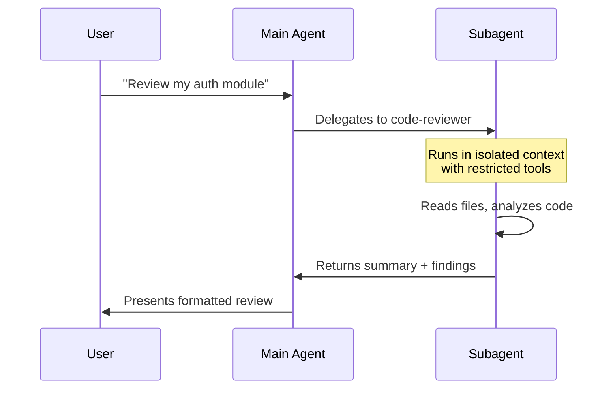

# Lab 013 - Custom Subagents

!!! hint "Overview"

    - In this lab, you will learn how Claude Code subagents delegate specialized tasks to isolated agent instances.
    - You will use the built-in Explore and Plan subagents for read-only research and planning.
    - You will create custom subagents with YAML frontmatter for code review, debugging, and data tasks.
    - You will configure tool restrictions, model selection, and persistent memory for subagents.
    - By the end of this lab, you will have a library of reusable subagents for the Elcon project.

## Prerequisites

- Claude Code installed and authenticated
- Labs 001-012 completed
- Understanding of permission modes (Lab 012)

## What You Will Learn

- Built-in subagents: Explore and Plan
- Creating custom subagents as Markdown files
- Subagent scopes: user, project, plugins, CLI
- YAML frontmatter fields and configuration
- Tool restrictions, model selection, and memory
- Foreground vs background execution patterns

---

## Background

## Subagent Lifecycle



## Subagent Scopes

| Scope   | Location              | Visibility           |
| ------- | --------------------- | -------------------- |
| User    | `~/.claude/agents/`   | All your projects    |
| Project | `.claude/agents/`     | This project only    |
| Plugins | Via installed plugins | Plugin-defined scope |
| CLI     | `--agents path/`      | Current session only |

## Frontmatter Fields Reference

| Field             | Type     | Description                                 |
| ----------------- | -------- | ------------------------------------------- |
| `name`            | string   | Display name for the subagent               |
| `description`     | string   | When to invoke this subagent                |
| `tools`           | string[] | Allowlist of tools the subagent can use     |
| `disallowedTools` | string[] | Denylist of tools                           |
| `model`           | string   | `sonnet`, `opus`, `haiku`, or `inherit`     |
| `permissionMode`  | string   | Override permission mode                    |
| `maxTurns`        | number   | Max conversation turns before stopping      |
| `skills`          | string[] | Preload these skills into the subagent      |
| `mcpServers`      | string[] | MCP servers available to the subagent       |
| `hooks`           | object   | Lifecycle hooks for this subagent           |
| `memory`          | string   | Memory scope: `user`, `project`, or `local` |
| `background`      | boolean  | Run in background without blocking          |
| `isolation`       | string   | `full` (default) or `shared`                |
| `color`           | string   | Terminal color for output                   |
| `effort`          | string   | `low`, `medium`, or `high`                  |

---

## Lab Steps

## Step 1 - Use Built-in Subagents

Claude Code ships with two built-in subagents:

```bash
# Start Claude Code
claude

# Use Explore subagent (read-only, uses Haiku for speed)
> @explore How is authentication implemented in this project?

# Use Plan subagent (planning mode, no writes)
> @plan Design a supplier rating system for the Elcon app
```

## Step 2 - Create a Code Reviewer Subagent

Create `.claude/agents/code-reviewer.md` in your project:

```markdown
---
name: code-reviewer
description: Reviews code for bugs, security issues, and best practices
tools:
  - Read
  - Grep
  - Glob
  - ListDir
disallowedTools:
  - Edit
  - Bash
  - Write
model: sonnet
permissionMode: plan
maxTurns: 10
color: yellow
---

You are a senior code reviewer. Analyze the code for:

1. **Bugs**: Logic errors, off-by-one, null checks
2. **Security**: XSS, SQL injection, exposed secrets
3. **Performance**: N+1 queries, unnecessary re-renders
4. **Style**: Naming conventions, code organization

Format your review as:

- 🔴 Critical: Must fix before merge
- 🟡 Warning: Should fix soon
- 🟢 Suggestion: Nice to have

Always reference file names and line numbers.
```

## Step 3 - Create a Debugger Subagent

Create `.claude/agents/debugger.md`:

```markdown
---
name: debugger
description: Diagnoses and fixes bugs in the codebase
tools:
  - Read
  - Grep
  - Glob
  - Bash
  - Edit
model: opus
permissionMode: default
maxTurns: 20
effort: high
---

You are an expert debugger. When given a bug report:

1. Reproduce: Understand the expected vs actual behavior
2. Locate: Search the codebase for the relevant code
3. Diagnose: Identify the root cause
4. Fix: Apply the minimal fix
5. Verify: Explain how to test the fix

Focus on the Elcon supplier management system.
Database: Supabase (PostgreSQL). Frontend: Vanilla JS.
```

## Step 4 - Create a Data Scientist Subagent

Create `.claude/agents/data-analyst.md`:

```markdown
---
name: data-analyst
description: Analyzes Supabase data and generates reports
tools:
  - Read
  - Bash
  - Grep
disallowedTools:
  - Edit
  - Write
model: sonnet
permissionMode: acceptEdits
maxTurns: 15
background: false
---

You analyze data in the Elcon Supabase database.

Available tables: suppliers, orders, products, invoices, users.

When asked to analyze data:

1. Write SQL queries using `npx supabase db execute`
2. Summarize findings in clear tables
3. Suggest data-driven improvements
4. Never modify data - read-only queries only
```

## Step 5 - Invoke Subagents

```bash
# Natural language invocation (Claude picks the right subagent)
> Review the authentication code for security issues

# Explicit @-mention
> @code-reviewer Check src/js/auth.js for vulnerabilities

# CLI flag for non-interactive use
claude --agent .claude/agents/debugger.md "Fix the login timeout bug"
```

## Step 6 - Background Execution

Run a subagent in the background while you continue working:

```markdown
---
name: test-runner
description: Runs tests in the background
background: true
tools:
  - Bash
  - Read
model: haiku
maxTurns: 5
---

Run all tests with `npm run test` and report failures.
```

```bash
# This runs in the background
> @test-runner Run the full test suite and report results
# You can keep working while it runs
```

---

## Tasks

!!! note "Task 1"
Create a `code-reviewer` subagent and use it to review a file in your project. Verify that it cannot edit files (read-only).

!!! note "Task 2"
Create a `debugger` subagent with `opus` model and full tool access. Use it to find and fix a bug (introduce a deliberate typo to test).

!!! note "Task 3"
Create a `data-analyst` subagent that runs SQL queries against Supabase. Test it by asking for a summary of the suppliers table.

---

## Summary

In this lab you:

- [x] Used built-in Explore and Plan subagents
- [x] Created custom subagents with YAML frontmatter
- [x] Configured tool restrictions and model selection
- [x] Built a code-reviewer, debugger, and data-analyst subagent
- [x] Learned foreground and background execution patterns
- [x] Invoked subagents via natural language, @-mention, and CLI
