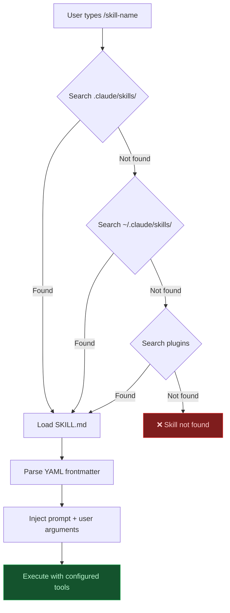

# Lab 014 - Skills & Custom Commands

!!! hint "Overview"

    - In this lab, you will learn how Claude Code skills provide reusable, on-demand prompt templates.
    - You will create SKILL.md files with YAML frontmatter for your team's coding standards.
    - You will understand the difference between skills, subagents, and CLAUDE.md instructions.
    - You will use slash commands as a legacy alternative and learn when to prefer skills.
    - By the end of this lab, you will have a skills library for the Elcon project.

## Prerequisites

- Claude Code installed and authenticated
- Labs 001-013 completed
- Understanding of subagents (Lab 013)

## What You Will Learn

- What skills are and how they differ from subagents
- SKILL.md file format with YAML frontmatter
- Frontmatter fields: description, tools, context, disable-model-invocation
- Invoking skills with `/skill-name` and `$ARGUMENTS`
- Progressive disclosure: skills loaded on demand
- Slash commands in `.claude/commands/` as legacy alternative
- Preloading skills into subagents

---

## Background

## Skill Resolution Flow



## Skills vs Subagents vs CLAUDE.md

| Feature       | CLAUDE.md              | Skills                    | Subagents                |
| ------------- | ---------------------- | ------------------------- | ------------------------ |
| Purpose       | Project-wide context   | Reusable task templates   | Isolated task delegation |
| Loaded        | Always (auto)          | On demand (`/skill`)      | On demand (`@agent`)     |
| Has own model | No                     | No (inherits)             | Yes (configurable)       |
| Has own tools | No                     | Yes (optional)            | Yes (required)           |
| Isolation     | None (same context)    | None (same context)       | Full (separate context)  |
| Memory        | N/A                    | N/A                       | Configurable             |
| Best for      | Standards, conventions | Repeated prompts, recipes | Complex delegated tasks  |

---

## Lab Steps

## Step 1 - Create Your First Skill

Create `.claude/skills/supabase-table/SKILL.md`:

```markdown
---
description: Creates a new Supabase table with RLS policies for the Elcon project
tools:
  - Bash
  - Edit
  - Read
---

Create a new Supabase migration for a table called $ARGUMENTS.

Follow these conventions:

1. Use snake_case for table and column names
2. Always include: id (uuid, PK), created_at, updated_at
3. Add Row Level Security (RLS) enabled
4. Create policies: select (authenticated), insert (authenticated), update (own rows), delete (admin only)
5. Use the migration command: `npx supabase migration new`

Example SQL structure:

- Primary key: `id uuid default gen_random_uuid() primary key`
- Timestamps: `created_at timestamptz default now()`
- Foreign keys reference the related table with `on delete cascade`
```

## Step 2 - Invoke the Skill

```bash
# Start Claude Code
claude

# Invoke the skill with arguments
> /supabase-table supplier_ratings

# The $ARGUMENTS placeholder becomes "supplier_ratings"
# Claude Code creates the migration with all conventions applied
```

## Step 3 - Create a Coding Standards Skill

Create `.claude/skills/code-style/SKILL.md`:

```markdown
---
description: Enforces Elcon team coding standards on a file or module
tools:
  - Read
  - Edit
  - Grep
---

Review and fix the code in $ARGUMENTS to match Elcon team standards:

**JavaScript conventions:**

- Use `const` by default, `let` only when reassignment is needed
- Arrow functions for callbacks
- Destructuring for object/array access
- Template literals instead of string concatenation
- Async/await instead of .then() chains
- JSDoc comments for public functions

**Naming:**

- camelCase for variables and functions
- PascalCase for classes
- SCREAMING_SNAKE for constants
- Prefix booleans with is/has/can

**Files:**

- Max 200 lines per file
- One class/module per file
- Group imports: external, internal, relative

**Supabase:**

- Always handle errors from Supabase calls
- Use .single() for expected single-row results
- RLS over application-level auth checks
```

## Step 4 - Skill with Context Fork

Create `.claude/skills/explain-code/SKILL.md`:

```markdown
---
description: Explains code in detail for learning purposes
disable-model-invocation: true
context: fork
---

Explain the following code in detail for a junior developer:

$ARGUMENTS

Break down:

1. What the code does (high-level purpose)
2. How it works (line by line)
3. Why it's written this way (design decisions)
4. Common pitfalls to watch for
5. How to test it

Use simple language. Provide examples where helpful.
```

The `context: fork` field means the skill runs in a forked context that doesn't affect the main conversation.

## Step 5 - Legacy Slash Commands

Slash commands in `.claude/commands/` still work but skills are preferred:

```bash
# Create a legacy slash command
mkdir -p .claude/commands
cat > .claude/commands/deploy.md << 'EOF'
Run the deployment checklist:
1. Run tests: npm run test
2. Build: npm run build
3. Check for uncommitted changes: git status
4. Push to main: git push origin main
5. Deploy to Supabase: npx supabase db push
Report status for each step.
EOF
```

```bash
# Use it in Claude Code
> /project:deploy
```

## Step 6 - Preload Skills into Subagents

Reference skills in subagent frontmatter:

```markdown
---
name: full-stack-dev
description: Full-stack developer for the Elcon project
skills:
  - supabase-table
  - code-style
model: sonnet
tools:
  - Read
  - Edit
  - Bash
  - Grep
  - Glob
---

You are a full-stack developer for the Elcon supplier management system.
Use the preloaded skills to maintain consistency.
```

---

## Tasks

!!! note "Task 1"
Create a `supabase-table` skill and use it to generate a migration for a `supplier_ratings` table with columns: supplier_id, rating, comment, rated_by.

!!! note "Task 2"
Create a `code-style` skill and run it on an existing JavaScript file. Verify it applies the naming conventions and patterns.

!!! note "Task 3"
Create a subagent that preloads both skills. Use it to create a new table and then write a JS module that queries it, following team standards.

---

## Summary

In this lab you:

- [x] Created reusable skills with SKILL.md and YAML frontmatter
- [x] Invoked skills with `/skill-name` and `$ARGUMENTS` placeholder
- [x] Built coding standards and Supabase table skills for the Elcon project
- [x] Understood context forking for isolated skill execution
- [x] Used legacy slash commands and learned when to prefer skills
- [x] Preloaded skills into subagents for combined workflows
