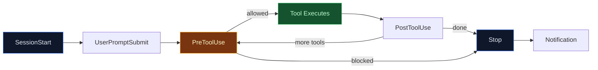

# Lab 015 - Hooks & Lifecycle Automation

!!! hint "Overview"

    - In this lab, you will learn how Claude Code hooks run shell commands or prompts at lifecycle points.
    - You will configure hooks to auto-lint files, block dangerous commands, and run tests after edits.
    - You will understand hook events, matcher patterns, and the JSON input/output format.
    - You will use PreToolUse hooks to control tool execution with allow, deny, and ask decisions.
    - By the end of this lab, you will have an automated quality pipeline triggered by Claude Code actions.

## Prerequisites

- Claude Code installed and authenticated
- Labs 001-014 completed
- Basic shell scripting knowledge

## What You Will Learn

- What hooks are and the 4 hook types: command, http, prompt, agent
- Hook events: SessionStart, PreToolUse, PostToolUse, Stop, and more
- Configuring hooks in settings.json
- Matcher patterns for targeting specific tools and actions
- Exit codes: 0 (allow) vs 2 (block)
- PreToolUse decision control
- Practical automation patterns for the Elcon project

---

## Background

## Hook Lifecycle



## Hook Events Reference

| Event              | When It Fires                         | Common Use                    |
| ------------------ | ------------------------------------- | ----------------------------- |
| `SessionStart`     | Claude Code session begins            | Load env vars, start services |
| `UserPromptSubmit` | User sends a message                  | Log prompts, validate input   |
| `PreToolUse`       | Before a tool runs (Edit, Bash, etc.) | Block dangerous ops, validate |
| `PostToolUse`      | After a tool completes                | Auto-lint, run tests, log     |
| `Stop`             | Agent finishes responding             | Cleanup, send notifications   |
| `SubagentStart`    | A subagent is launched                | Log subagent activity         |
| `SubagentStop`     | A subagent finishes                   | Collect subagent results      |
| `Notification`     | Agent sends a notification            | Custom notification routing   |

---

## Lab Steps

## Step 1 - Configure Your First Hook

Add hooks to `.claude/settings.json`:

```json
{
  "hooks": {
    "PostToolUse": [
      {
        "matcher": "Edit",
        "type": "command",
        "command": "echo '✅ File edited: '$(echo $CLAUDE_HOOK_INPUT | jq -r '.tool_input.file_path')"
      }
    ]
  }
}
```

## Step 2 - Block Dangerous Commands

Create a PreToolUse hook that blocks `rm -rf`:

```json
{
  "hooks": {
    "PreToolUse": [
      {
        "matcher": "Bash",
        "type": "command",
        "command": ".claude/hooks/check-dangerous.sh"
      }
    ]
  }
}
```

Create `.claude/hooks/check-dangerous.sh`:

```bash
#!/bin/bash
# Read the hook input from stdin
INPUT=$(cat)
COMMAND=$(echo "$INPUT" | jq -r '.tool_input.command')

# Block dangerous patterns
if echo "$COMMAND" | grep -qE 'rm -rf|drop table|truncate|format'; then
  echo '{"decision": "deny", "reason": "Blocked: dangerous command detected"}'
  exit 0
fi

# Allow everything else
echo '{"decision": "allow"}'
exit 0
```

```bash
# Make it executable
chmod +x .claude/hooks/check-dangerous.sh
```

## Step 3 - Auto-Lint After Edits

```json
{
  "hooks": {
    "PostToolUse": [
      {
        "matcher": "Edit",
        "type": "command",
        "command": ".claude/hooks/auto-lint.sh"
      }
    ]
  }
}
```

Create `.claude/hooks/auto-lint.sh`:

```bash
#!/bin/bash
INPUT=$(cat)
FILE=$(echo "$INPUT" | jq -r '.tool_input.file_path // empty')

if [[ -z "$FILE" ]]; then
  exit 0
fi

# Lint based on file type
case "$FILE" in
  *.js)
    npx eslint --fix "$FILE" 2>/dev/null
    ;;
  *.css)
    npx stylelint --fix "$FILE" 2>/dev/null
    ;;
  *.html)
    npx prettier --write "$FILE" 2>/dev/null
    ;;
esac

exit 0
```

## Step 4 - Run Tests After Write Operations

```json
{
  "hooks": {
    "PostToolUse": [
      {
        "matcher": "Edit",
        "type": "command",
        "command": ".claude/hooks/auto-test.sh"
      }
    ]
  }
}
```

Create `.claude/hooks/auto-test.sh`:

```bash
#!/bin/bash
INPUT=$(cat)
FILE=$(echo "$INPUT" | jq -r '.tool_input.file_path // empty')

# Only run tests for source files
if [[ "$FILE" == src/* ]]; then
  # Find matching test file
  TEST_FILE=$(echo "$FILE" | sed 's/src\//tests\//' | sed 's/\.js$/.test.js/')
  if [[ -f "$TEST_FILE" ]]; then
    npm test -- "$TEST_FILE" 2>/dev/null
  fi
fi

exit 0
```

## Step 5 - Complete Hooks Configuration

Combine all hooks in `.claude/settings.json`:

```json
{
  "hooks": {
    "SessionStart": [
      {
        "type": "command",
        "command": "echo '🚀 Elcon project session started at '$(date)"
      }
    ],
    "PreToolUse": [
      {
        "matcher": "Bash",
        "type": "command",
        "command": ".claude/hooks/check-dangerous.sh"
      }
    ],
    "PostToolUse": [
      {
        "matcher": "Edit",
        "type": "command",
        "command": ".claude/hooks/auto-lint.sh"
      },
      {
        "matcher": "Edit",
        "type": "command",
        "command": ".claude/hooks/auto-test.sh"
      }
    ],
    "Stop": [
      {
        "type": "command",
        "command": "echo '✅ Session complete. Token cost: check /cost'"
      }
    ]
  }
}
```

## Step 6 - Inspect Active Hooks

```bash
# Inside a Claude Code session
/hooks

# This shows all active hooks, their events, and matchers
```

Test your hooks by editing a file and watching the auto-lint and test output:

```bash
claude

> Fix the login validation in src/js/auth.js
# After Claude edits the file:
# - auto-lint.sh runs eslint --fix
# - auto-test.sh runs the matching test file
```

---

## Tasks

!!! note "Task 1"
Create a PreToolUse hook that blocks any Bash command containing `sudo` or `rm -rf`. Test it by asking Claude Code to run a blocked command.

!!! note "Task 2"
Create a PostToolUse hook that runs `prettier --write` on any `.js`, `.html`, or `.css` file after Claude Code edits it.

!!! note "Task 3"
Create a complete hooks configuration with SessionStart (log), PreToolUse (block dangerous), PostToolUse (lint + test), and Stop (summary). Verify each hook fires correctly.

---

## Summary

In this lab you:

- [x] Learned the hook lifecycle and all hook events
- [x] Configured PreToolUse hooks to block dangerous commands
- [x] Built PostToolUse hooks for auto-linting and auto-testing
- [x] Understood the JSON input/output format and exit codes
- [x] Created a complete hooks pipeline for the Elcon project
- [x] Inspected active hooks with the `/hooks` command
