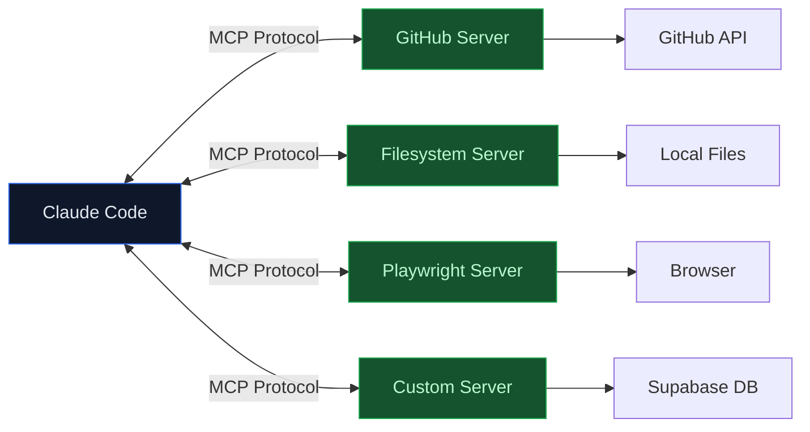

# Lab 016 - MCP Server Integration

!!! hint "Overview"

    - In this lab, you will learn how the Model Context Protocol (MCP) extends Claude Code with external tools and services.
    - You will configure MCP servers for GitHub, filesystem, and browser automation.
    - You will understand server types (stdio, http, sse) and scoping (user vs project).
    - You will build a simple MCP server and integrate it with the Elcon project.
    - By the end of this lab, you will connect Claude Code to databases, APIs, and browsers via MCP.

## Prerequisites

- Claude Code installed and authenticated
- Labs 001-015 completed
- Node.js 18+ installed
- GitHub account configured

## What You Will Learn

- What MCP (Model Context Protocol) is and why it matters
- Configuring MCP servers in `.mcp.json` and `~/.claude.json`
- Server types: stdio, http, sse, ws
- Common MCP servers: GitHub, filesystem, Playwright
- MCP tool naming convention: `mcp__server__tool`
- Scoping MCP to subagents
- Building a custom MCP server

---

## Background

## MCP Architecture



## Common MCP Servers

| Server     | Package                                   | Tools Provided                      |
| ---------- | ----------------------------------------- | ----------------------------------- |
| GitHub     | `@modelcontextprotocol/server-github`     | Issues, PRs, repos, search          |
| Filesystem | `@modelcontextprotocol/server-filesystem` | Read, write, search across paths    |
| Playwright | `@anthropic-ai/mcp-server-playwright`     | Navigate, click, screenshot, scrape |
| Memory     | `@modelcontextprotocol/server-memory`     | Persistent key-value store          |
| PostgreSQL | `@modelcontextprotocol/server-postgres`   | SQL queries, schema inspection      |
| Fetch      | `@modelcontextprotocol/server-fetch`      | HTTP requests to external APIs      |

---

## Lab Steps

## Step 1 - Create a Project MCP Configuration

Create `.mcp.json` in your project root:

```json
{
  "mcpServers": {
    "github": {
      "type": "stdio",
      "command": "npx",
      "args": ["-y", "@modelcontextprotocol/server-github"],
      "env": {
        "GITHUB_TOKEN": "${GITHUB_TOKEN}"
      }
    }
  }
}
```

```bash
# Set your GitHub token
export GITHUB_TOKEN="ghp_your_token_here"

# Start Claude Code - it auto-discovers .mcp.json
claude
```

## Step 2 - Add Filesystem and Playwright Servers

Extend `.mcp.json`:

```json
{
  "mcpServers": {
    "github": {
      "type": "stdio",
      "command": "npx",
      "args": ["-y", "@modelcontextprotocol/server-github"],
      "env": {
        "GITHUB_TOKEN": "${GITHUB_TOKEN}"
      }
    },
    "playwright": {
      "type": "stdio",
      "command": "npx",
      "args": ["-y", "@anthropic-ai/mcp-server-playwright"]
    },
    "filesystem": {
      "type": "stdio",
      "command": "npx",
      "args": [
        "-y",
        "@modelcontextprotocol/server-filesystem",
        "/Users/nirg/elcon-project"
      ]
    }
  }
}
```

## Step 3 - Use MCP Tools in Claude Code

MCP tools follow the naming convention `mcp__server__tool`:

```bash
claude

# Claude Code now has access to MCP tools:
> Create a new GitHub issue for the Elcon project titled "Add supplier rating feature"
# Uses: mcp__github__create_issue

> Take a screenshot of http://localhost:3000
# Uses: mcp__playwright__screenshot

> Search for all .sql files in the project
# Uses: mcp__filesystem__search
```

## Step 4 - User-Scope MCP Configuration

For servers you want across all projects, add them to `~/.claude.json`:

```json
{
  "mcpServers": {
    "memory": {
      "type": "stdio",
      "command": "npx",
      "args": ["-y", "@modelcontextprotocol/server-memory"]
    },
    "fetch": {
      "type": "stdio",
      "command": "npx",
      "args": ["-y", "@modelcontextprotocol/server-fetch"]
    }
  }
}
```

## Step 5 - Scope MCP to Subagents

Restrict MCP servers to specific subagents in `.claude/agents/`:

```markdown
---
name: qa-tester
description: Tests the Elcon app in a real browser
mcpServers:
  - playwright
tools:
  - Read
  - Bash
model: sonnet
maxTurns: 15
---

You are a QA tester for the Elcon supplier management system.

Use Playwright MCP to:

1. Navigate to the app URL
2. Test login flow
3. Verify supplier list loads
4. Check form submissions work
5. Take screenshots of each step

Report pass/fail for each test case.
```

## Step 6 - Build a Custom MCP Server

Create a simple Supabase MCP server for the Elcon project:

```javascript
// mcp-supabase-server.js
import { Server } from "@modelcontextprotocol/sdk/server/index.js";
import { StdioServerTransport } from "@modelcontextprotocol/sdk/server/stdio.js";
import { createClient } from "@supabase/supabase-js";

const supabase = createClient(
  process.env.SUPABASE_URL,
  process.env.SUPABASE_SERVICE_KEY,
);

const server = new Server(
  {
    name: "elcon-supabase",
    version: "1.0.0",
  },
  {
    capabilities: { tools: {} },
  },
);

server.setRequestHandler("tools/list", async () => ({
  tools: [
    {
      name: "query_suppliers",
      description: "Query the suppliers table with optional filters",
      inputSchema: {
        type: "object",
        properties: {
          status: { type: "string", enum: ["active", "inactive", "pending"] },
          limit: { type: "number", default: 50 },
        },
      },
    },
    {
      name: "get_supplier_stats",
      description: "Get supplier statistics and counts",
      inputSchema: { type: "object", properties: {} },
    },
  ],
}));

server.setRequestHandler("tools/call", async (request) => {
  const { name, arguments: args } = request.params;

  if (name === "query_suppliers") {
    let query = supabase.from("suppliers").select("*");
    if (args.status) query = query.eq("status", args.status);
    if (args.limit) query = query.limit(args.limit);
    const { data, error } = await query;
    return { content: [{ type: "text", text: JSON.stringify(data, null, 2) }] };
  }

  if (name === "get_supplier_stats") {
    const { count } = await supabase
      .from("suppliers")
      .select("*", { count: "exact", head: true });
    return { content: [{ type: "text", text: `Total suppliers: ${count}` }] };
  }
});

const transport = new StdioServerTransport();
await server.connect(transport);
```

Register it in `.mcp.json`:

```json
{
  "mcpServers": {
    "elcon-supabase": {
      "type": "stdio",
      "command": "node",
      "args": ["mcp-supabase-server.js"],
      "env": {
        "SUPABASE_URL": "${SUPABASE_URL}",
        "SUPABASE_SERVICE_KEY": "${SUPABASE_SERVICE_KEY}"
      }
    }
  }
}
```

```bash
claude

> How many active suppliers do we have?
# Uses: mcp__elcon-supabase__get_supplier_stats
```

---

## Tasks

!!! note "Task 1"
Configure `.mcp.json` with the GitHub MCP server. Use Claude Code to create a GitHub issue on your repo.

!!! note "Task 2"
Add the Playwright MCP server and use Claude Code to navigate to a URL, take a screenshot, and verify page content.

!!! note "Task 3"
Build a custom MCP server that queries your Supabase `suppliers` table. Register it in `.mcp.json` and test it from Claude Code.

---

## Summary

In this lab you:

- [x] Understood MCP architecture and how it extends Claude Code
- [x] Configured project-scope and user-scope MCP servers
- [x] Used GitHub, Playwright, and Filesystem MCP servers
- [x] Learned the `mcp__server__tool` naming convention
- [x] Scoped MCP servers to specific subagents
- [x] Built a custom Supabase MCP server for the Elcon project
