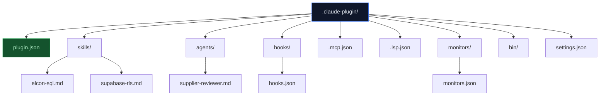

# Lab 017 - Plugins & Marketplaces

!!! hint "Overview"

    - In this lab, you will learn how Claude Code plugins package skills, agents, hooks, and MCP servers into reusable extensions.
    - You will create a plugin from scratch with the correct directory structure and manifest.
    - You will install plugins from marketplaces including GitHub repos, npm packages, and git URLs.
    - You will configure plugin settings, background monitors, and LSP servers.
    - By the end of this lab, you will have a working Elcon plugin ready for team sharing.

## Prerequisites

- Claude Code installed and authenticated
- Labs 001-016 completed
- Understanding of skills (Lab 014), hooks (Lab 015), and MCP servers (Lab 016)

## What You Will Learn

- Plugin structure and the plugin.json manifest schema
- Creating and testing plugins locally with `--plugin-dir`
- Namespaced skills and agents from plugins
- Installing plugins from marketplaces and git URLs
- Background monitors and LSP server plugins
- Shipping default settings and securing plugin agents

---

## Background

## Plugin Architecture



## Plugin Components

| Component        | File / Directory         | Purpose                                     |
| ---------------- | ------------------------ | ------------------------------------------- |
| Manifest         | `plugin.json`            | Name, version, author, license metadata     |
| Skills           | `skills/*.md`            | Reusable instructions with YAML frontmatter |
| Agents           | `agents/*.md`            | Subagent definitions for delegation         |
| Hooks            | `hooks/hooks.json`       | Lifecycle event handlers                    |
| MCP Servers      | `.mcp.json`              | Model Context Protocol server configs       |
| LSP Servers      | `.lsp.json`              | Language Server Protocol integrations       |
| Monitors         | `monitors/monitors.json` | Background processes that watch for events  |
| Binaries         | `bin/`                   | CLI tools shipped with the plugin           |
| Default Settings | `settings.json`          | Shipped settings applied on install         |

---

## Lab Steps

## Step 1 - Create a Plugin Directory

Create the plugin scaffold for an Elcon-specific plugin:

```bash
mkdir -p .claude-plugin/skills .claude-plugin/agents .claude-plugin/hooks .claude-plugin/monitors
```

## Step 2 - Write the Plugin Manifest

Create `.claude-plugin/plugin.json`:

```json
{
  "name": "elcon-supplier-tools",
  "description": "Claude Code plugin for Elcon supplier management workflows",
  "version": "1.0.0",
  "author": "Elcon Dev Team",
  "homepage": "https://github.com/elcon/supplier-tools",
  "repository": "https://github.com/elcon/supplier-tools",
  "license": "MIT"
}
```

## Step 3 - Add a Namespaced Skill

Create `.claude-plugin/skills/supplier-sql.md`:

```markdown
---
name: supplier-sql
description: Generates optimized SQL queries for the Elcon supplier database
---

You are an expert in Supabase PostgreSQL. When asked to query supplier data:

1. Use the correct table names: suppliers, orders, products, invoices
2. Always include RLS-compatible WHERE clauses
3. Prefer CTEs over nested subqueries
4. Add LIMIT clauses to prevent runaway queries

Example tables:

- suppliers(id, name, contact_email, rating, created_at)
- orders(id, supplier_id, total_amount, status, order_date)
- products(id, supplier_id, name, price, stock_quantity)
```

This skill is invoked as `/elcon-supplier-tools:supplier-sql` - the plugin name is the namespace.

## Step 4 - Add a Plugin Agent

Create `.claude-plugin/agents/supplier-reviewer.md`:

```markdown
---
name: supplier-reviewer
description: Reviews supplier-related code for Elcon business rules
tools:
  - Read
  - Grep
  - Glob
disallowedTools:
  - Edit
  - Bash
model: sonnet
maxTurns: 10
---

Review supplier management code for Elcon business rules:

- Supplier rating must be 1-5
- Orders require approved supplier status
- Invoice amounts must match order totals
- Contact email is mandatory for active suppliers
```

!!! warning "Security"
Plugin agents cannot define `hooks`, `mcpServers`, or `permissionMode`. These are restricted to prevent plugins from escalating privileges.

## Step 5 - Add Hooks and Monitors

Create `.claude-plugin/hooks/hooks.json`:

```json
{
  "PostToolUse": [
    {
      "matcher": "Edit(src/suppliers/**)",
      "command": "npm run lint -- --fix $CLAUDE_FILE_PATH"
    }
  ]
}
```

Create `.claude-plugin/monitors/monitors.json`:

```json
{
  "monitors": [
    {
      "name": "supplier-schema-watch",
      "command": "npx supabase db diff --schema public",
      "interval": 60,
      "description": "Checks for uncommitted schema changes every 60 seconds"
    }
  ]
}
```

## Step 6 - Test Locally

Load the plugin from a local directory:

```bash
# Test without installing globally
claude --plugin-dir ./.claude-plugin

# Inside the session, verify it loaded
/plugins

# Use the namespaced skill
> /elcon-supplier-tools:supplier-sql Write a query to find top 10 suppliers by order volume

# Reload after making changes
/reload-plugins
```

## Step 7 - Install from Marketplaces

Plugins can be installed from multiple sources:

```bash
# From a GitHub repository
/plugin install github:elcon/supplier-tools

# From a git URL
/plugin install https://github.com/elcon/supplier-tools.git

# From an npm package
/plugin install npm:@elcon/claude-plugin-suppliers
```

Configure team-wide marketplaces in `settings.json`:

```json
{
  "extraKnownMarketplaces": [
    "https://github.com/elcon/claude-plugins-registry"
  ],
  "enabledPlugins": ["elcon-supplier-tools", "supabase-helpers"]
}
```

## Step 8 - Ship Default Settings

Add `settings.json` to the plugin root to provide defaults on install:

```json
{
  "permissions": {
    "allow": ["Bash(npx supabase *)", "Read(src/suppliers/**)"]
  }
}
```

---

## Tasks

!!! note "Task 1"
Create a complete plugin with a manifest, one skill for Supabase RLS policies, and one agent for reviewing database migrations. Test it locally with `--plugin-dir`.

!!! note "Task 2"
Add a background monitor that runs `npx supabase db diff` every 120 seconds and a hook that lints SQL files after edits. Verify both work with `/plugins`.

!!! note "Task 3"
Configure `extraKnownMarketplaces` in your settings to point to a GitHub repository. Enable only your plugin in `enabledPlugins` and verify with `/status`.

---

## Summary

In this lab you:

- [x] Learned the plugin directory structure and manifest schema
- [x] Created a plugin with skills, agents, hooks, and monitors
- [x] Used namespaced skills with the `/plugin-name:skill-name` syntax
- [x] Tested plugins locally with `--plugin-dir` and `/reload-plugins`
- [x] Installed plugins from GitHub repos and npm packages
- [x] Configured team marketplaces and enabled plugins
- [x] Understood plugin security restrictions on agents
