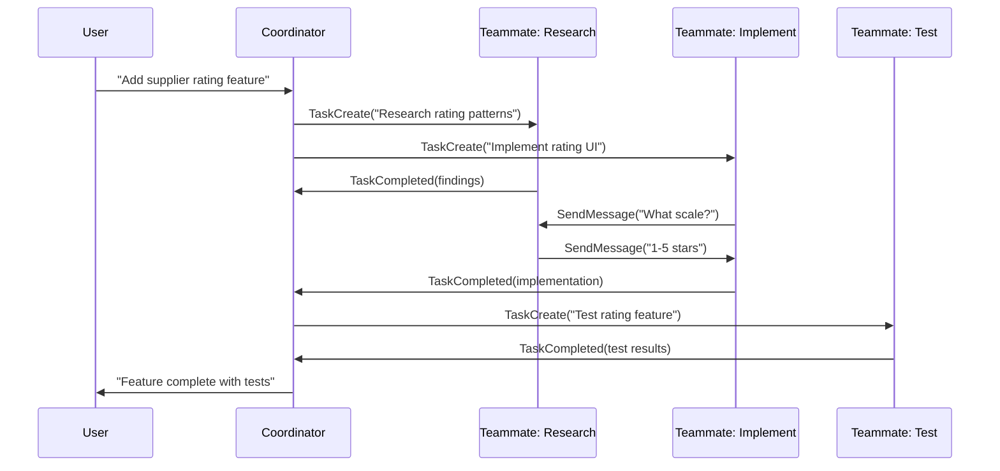

# Lab 018 - Agent Teams & Multi-Agent Workflows

!!! hint "Overview"

    - In this lab, you will learn how Claude Code agent teams run multiple Claude instances in parallel to tackle complex tasks.
    - You will enable agent teams and configure teammates with isolated git worktrees.
    - You will use TaskCreate, TaskCompleted, and SendMessage tools for inter-agent coordination.
    - You will build multi-agent workflows: divide-and-conquer, pipeline, and review loop patterns.
    - By the end of this lab, you will have a working agent team that researches, implements, and tests Elcon features simultaneously.

## Prerequisites

- Claude Code installed and authenticated
- Labs 001-016 completed
- Git installed and basic worktree understanding
- Understanding of subagents (Lab 013)

## What You Will Learn

- Enabling and configuring agent teams
- Display modes: auto, in-process, tmux
- Git worktrees for agent isolation
- TaskCreate, TaskCompleted, and SendMessage tools
- Team-related hooks for lifecycle events
- Multi-agent workflow patterns for real projects

---

## Background

## Agent Team Architecture



## Team-Related Hooks

| Hook            | Trigger                              | Use Case                          |
| --------------- | ------------------------------------ | --------------------------------- |
| `TaskCreated`   | A new task is assigned to a teammate | Log task assignments, notify team |
| `TaskCompleted` | A teammate finishes its task         | Trigger next pipeline stage       |
| `TeammateIdle`  | A teammate has no pending work       | Assign new work or shut down      |

## Display Modes

| Mode         | Behavior                                      | Best For                  |
| ------------ | --------------------------------------------- | ------------------------- |
| `auto`       | Picks the best mode based on terminal support | Default, recommended      |
| `in-process` | All teammates share the same terminal output  | Simple tasks, debugging   |
| `tmux`       | Each teammate gets its own tmux pane          | Complex tasks, monitoring |

---

## Lab Steps

## Step 1 - Enable Agent Teams

Agent teams are an experimental feature. Enable them with an environment variable:

```bash
# Enable agent teams
export CLAUDE_CODE_EXPERIMENTAL_AGENT_TEAMS=1

# Start Claude Code
claude
```

Or set it permanently in your shell profile:

```bash
echo 'export CLAUDE_CODE_EXPERIMENTAL_AGENT_TEAMS=1' >> ~/.zshrc
source ~/.zshrc
```

## Step 2 - Create a Basic Team Task

Inside a Claude Code session, describe a task that benefits from parallelism:

```
Add a supplier rating system to the Elcon app.
Have one teammate research best practices for rating systems,
another implement the database schema and API,
and a third write the frontend UI.
```

Claude will use `TaskCreate` to spawn teammates:

```
TaskCreate: "Research supplier rating system patterns and database schemas"
TaskCreate: "Implement rating table migration and Supabase RPC functions"
TaskCreate: "Build the star-rating UI component in vanilla JS"
```

## Step 3 - Configure Worktrees for Isolation

Teammates work in isolated git worktrees to avoid file conflicts:

```bash
# Claude Code automatically creates worktrees with --worktree
# Each teammate gets its own copy of the repository

# Manual worktree creation for reference:
git worktree add ../elcon-research -b feature/rating-research
git worktree add ../elcon-implement -b feature/rating-impl
git worktree add ../elcon-test -b feature/rating-test
```

Configure worktree behavior in `.claude/settings.json`:

```json
{
  "worktree": {
    "symlinkDirectories": ["node_modules", ".supabase"],
    "sparsePaths": ["src/", "supabase/", "package.json"]
  }
}
```

Use `.worktreeinclude` to copy gitignored files into worktrees:

```
# .worktreeinclude
.env.local
node_modules/.cache
```

## Step 4 - Inter-Agent Communication

Teammates communicate through `SendMessage`:

```
# Teammate 1 (Research) sends findings:
SendMessage(to: "Implement", "Use a 1-5 integer scale.
Store in suppliers.rating column. Add a ratings table
for individual reviews with supplier_id, user_id, score, comment.")

# Teammate 2 (Implement) acknowledges:
SendMessage(to: "Research", "Got it. Creating migration now.")
```

## Step 5 - Configure Team Hooks

Add hooks to respond to team lifecycle events in `.claude/settings.json`:

```json
{
  "hooks": {
    "TaskCreated": [
      {
        "command": "echo \"[$(date)] Task created: $CLAUDE_TASK_DESCRIPTION\" >> .claude/team-log.txt"
      }
    ],
    "TaskCompleted": [
      {
        "command": "echo \"[$(date)] Task completed: $CLAUDE_TASK_ID\" >> .claude/team-log.txt"
      }
    ],
    "TeammateIdle": [
      {
        "command": "echo \"[$(date)] Teammate idle: $CLAUDE_TEAMMATE_ID\" >> .claude/team-log.txt"
      }
    ]
  }
}
```

## Step 6 - Define Teammates as Subagents

Create reusable teammate definitions in `.claude/agents/`:

```markdown
## <!-- .claude/agents/researcher.md -->

name: researcher
description: Researches patterns and best practices before implementation
tools:

- Read
- Grep
- Glob
- WebFetch
  disallowedTools:
- Edit
- Bash
  model: sonnet
  maxTurns: 15

---

You are a research specialist. When given a task:

1. Search the existing codebase for related patterns
2. Identify best practices for the approach
3. Document your findings clearly
4. Send recommendations to the implementation teammate
```

```markdown
## <!-- .claude/agents/implementer.md -->

name: implementer
description: Implements features based on research findings
tools:

- Read
- Edit
- Bash
- Grep
  model: opus
  maxTurns: 30
  effort: high

---

You implement features for the Elcon supplier management system.
Stack: Supabase (PostgreSQL), vanilla JS, HTML/CSS.
Wait for research findings before starting implementation.
```

## Step 7 - Agent Team Patterns

**Divide and Conquer**: Split independent subtasks across teammates.

```
Build the Elcon dashboard with three sections in parallel:
1. Supplier overview chart
2. Recent orders table
3. Alert notifications panel
```

**Pipeline**: Each teammate hands off to the next.

```
First research the Supabase realtime API,
then implement live order notifications,
then write integration tests for the feature.
```

**Review Loop**: One teammate implements, another reviews, iterate.

```
Implement the supplier import CSV feature.
Have a reviewer check each iteration for security issues
(SQL injection, file validation). Iterate until approved.
```

---

## Tasks

!!! note "Task 1"
Enable agent teams and create a task that spawns two teammates: one to add a `supplier_notes` column to the database and one to build the UI for editing notes. Verify both worktrees are created.

!!! note "Task 2"
Create `.claude/agents/` definitions for a researcher and implementer teammate. Use them to add a supplier search feature with the pipeline pattern.

!!! note "Task 3"
Configure team hooks that log all `TaskCreated` and `TaskCompleted` events to `.claude/team-log.txt`. Run a multi-agent task and verify the log output.

---

## Summary

In this lab you:

- [x] Enabled agent teams with the experimental environment variable
- [x] Spawned parallel teammates with TaskCreate
- [x] Used git worktrees for isolated agent workspaces
- [x] Configured SendMessage for inter-agent communication
- [x] Set up lifecycle hooks for TaskCreated, TaskCompleted, and TeammateIdle
- [x] Built multi-agent workflows: divide-and-conquer, pipeline, and review loop
