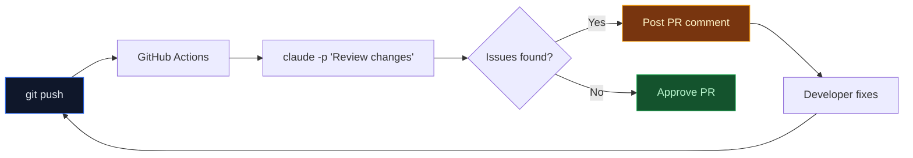

# Lab 019 - CLI Mastery & Automation

!!! hint "Overview"

    - In this lab, you will learn Claude Code's non-interactive CLI for scripting, automation, and CI/CD pipelines.
    - You will use print mode (`-p`), output formats, and structured JSON schemas for machine-readable output.
    - You will manage sessions, control budgets, and select models from the command line.
    - You will build automation scripts and integrate Claude Code into GitHub Actions workflows.
    - By the end of this lab, you will have a fully automated code review pipeline for the Elcon project.

## Prerequisites

- Claude Code installed and authenticated
- Labs 001-016 completed
- Basic shell scripting knowledge (bash/zsh)
- GitHub repository with Actions enabled (optional)

## What You Will Learn

- Non-interactive mode with `claude -p` for scripted usage
- Output formats: text, json, stream-json
- Structured outputs with `--json-schema`
- Session management: continue, resume, name
- Budget and turn limits for cost control
- CI/CD integration with GitHub Actions

---

## Background

## CI/CD Pipeline with Claude Code



## Key CLI Flags

| Flag               | Description                                     | Example                                       |
| ------------------ | ----------------------------------------------- | --------------------------------------------- |
| `-p`               | Print mode (non-interactive, exits after reply) | `claude -p "explain this code"`               |
| `--output-format`  | Output format: text, json, stream-json          | `claude -p --output-format json "query"`      |
| `--json-schema`    | Validate output against a JSON schema           | `claude -p --json-schema schema.json "query"` |
| `--continue`       | Continue the most recent session                | `claude --continue`                           |
| `--resume`         | Resume a specific session by ID                 | `claude --resume SESSION_ID`                  |
| `--name`           | Name the current session                        | `claude --name "elcon-review"`                |
| `--max-budget-usd` | Maximum spend for this session                  | `claude -p --max-budget-usd 1.00 "query"`     |
| `--max-turns`      | Maximum agent turns                             | `claude -p --max-turns 5 "query"`             |
| `--model`          | Select model: sonnet, opus, haiku               | `claude -p --model haiku "query"`             |
| `--effort`         | Effort level: low, medium, high, xhigh, max     | `claude -p --effort low "query"`              |
| `--bare`           | Fast mode, no project context loaded            | `claude -p --bare "quick question"`           |
| `--system-prompt`  | Override the system prompt                      | `claude -p --system-prompt "Be brief" "q"`    |
| `--fallback-model` | Fallback when primary model is overloaded       | `claude -p --fallback-model haiku "query"`    |

---

## Lab Steps

## Step 1 - Non-Interactive Print Mode

Use `-p` to run Claude Code as a one-shot command:

```bash
# Simple query
claude -p "What does the suppliers table schema look like?"

# Pipe file content
cat src/js/suppliers.js | claude -p "Find potential bugs in this code"

# Pipe multiple files
find src/ -name "*.js" | head -5 | xargs cat | claude -p "Summarize these modules"
```

## Step 2 - Output Formats

Control how output is structured:

```bash
# Plain text (default)
claude -p "List all Supabase tables" --output-format text

# JSON with metadata (tokens, model, duration)
claude -p "List all Supabase tables" --output-format json

# Streaming JSON for real-time processing
claude -p "Explain the order flow" --output-format stream-json | \
  jq -r 'select(.type == "text") | .text'
```

## Step 3 - Structured JSON Output

Use `--json-schema` to get validated, machine-readable responses:

```bash
# Define a schema
cat > /tmp/review-schema.json << 'EOF'
{
  "type": "object",
  "properties": {
    "issues": {
      "type": "array",
      "items": {
        "type": "object",
        "properties": {
          "file": { "type": "string" },
          "line": { "type": "number" },
          "severity": { "enum": ["critical", "warning", "info"] },
          "message": { "type": "string" }
        },
        "required": ["file", "severity", "message"]
      }
    },
    "summary": { "type": "string" }
  },
  "required": ["issues", "summary"]
}
EOF

# Get structured review results
cat src/js/auth.js | claude -p \
  --json-schema /tmp/review-schema.json \
  "Review this code for security issues"
```

## Step 4 - Session Management

Continue and resume previous conversations:

```bash
# Start a named session
claude --name "elcon-supplier-feature"

# Continue the most recent session
claude --continue

# List sessions and resume a specific one
claude sessions list
claude --resume abc123-session-id

# Continue with a new prompt
claude --continue -p "Now add input validation to the form"
```

## Step 5 - Budget and Model Control

Control costs and model selection:

```bash
# Limit spending to $0.50 for this task
claude -p --max-budget-usd 0.50 "Refactor the supplier module"

# Limit to 5 agent turns
claude -p --max-turns 5 "Add error handling to fetchSuppliers()"

# Use fast model for simple tasks
claude -p --model haiku "What does this function return?"

# Use powerful model with fallback
claude -p --model opus --fallback-model sonnet "Design the new invoice system"

# Low effort for quick answers
claude -p --effort low "What port does the dev server use?"
```

## Step 6 - System Prompt Customization

Override or extend the system prompt for specialized behavior:

```bash
# Custom system prompt
claude -p --system-prompt "You are an Elcon database expert. Only answer SQL questions." \
  "How do I join suppliers with orders?"

# Append to default system prompt
claude -p --append-system-prompt "Always include Hebrew comments in code" \
  "Create a function to calculate supplier rating"

# Load system prompt from file
claude -p --system-prompt-file .claude/prompts/elcon-reviewer.txt \
  "Review the latest changes"
```

## Step 7 - CI/CD Integration with GitHub Actions

Create `.github/workflows/claude-review.yml`:

```yaml
name: Claude Code Review
on:
  pull_request:
    types: [opened, synchronize]

jobs:
  review:
    runs-on: ubuntu-latest
    steps:
      - uses: actions/checkout@v4
        with:
          fetch-depth: 0

      - name: Install Claude Code
        run: npm install -g @anthropic-ai/claude-code

      - name: Setup authentication
        run: claude setup-token "${{ secrets.CLAUDE_API_KEY }}"

      - name: Review PR changes
        run: |
          git diff origin/main...HEAD -- '*.js' '*.ts' | \
          claude -p \
            --model sonnet \
            --max-budget-usd 0.50 \
            --max-turns 3 \
            --output-format json \
            "Review these changes for bugs and security issues. Be concise." \
          > review.json

      - name: Post review comment
        if: always()
        uses: actions/github-script@v7
        with:
          script: |
            const fs = require('fs');
            const review = JSON.parse(fs.readFileSync('review.json', 'utf8'));
            await github.rest.issues.createComment({
              owner: context.repo.owner,
              repo: context.repo.repo,
              issue_number: context.issue.number,
              body: `## Claude Code Review\n\n${review.result}`
            });
```

## Step 8 - Build Automation Scripts

Create a batch processing script for the Elcon project:

```bash
#!/bin/bash
# scripts/batch-review.sh - Review all JS files for issues

OUTPUT_DIR="reviews"
mkdir -p "$OUTPUT_DIR"

for file in src/js/*.js; do
  filename=$(basename "$file" .js)
  echo "Reviewing $file..."

  cat "$file" | claude -p \
    --bare \
    --model haiku \
    --max-turns 1 \
    --effort low \
    "List any bugs or security issues. Reply NONE if clean." \
    > "$OUTPUT_DIR/${filename}-review.txt"
done

echo "Reviews saved to $OUTPUT_DIR/"
```

---

## Tasks

!!! note "Task 1"
Use `claude -p` with `--json-schema` to analyze `src/js/suppliers.js` and get a structured JSON report of all functions, their parameters, and return types.

!!! note "Task 2"
Create a shell script that uses `claude -p --continue` to have a multi-step conversation: first analyze the codebase, then suggest improvements, then generate a migration plan.

!!! note "Task 3"
Write a GitHub Actions workflow that runs `claude -p` on every PR to check for SQL injection vulnerabilities in JavaScript files. Use `--max-budget-usd 0.25` to control costs.

---

## Summary

In this lab you:

- [x] Used `claude -p` for non-interactive scripted queries
- [x] Controlled output formats: text, json, stream-json
- [x] Validated responses with `--json-schema` for structured output
- [x] Managed sessions with `--continue`, `--resume`, and `--name`
- [x] Controlled costs with `--max-budget-usd` and `--max-turns`
- [x] Integrated Claude Code into GitHub Actions CI/CD pipelines
- [x] Built automation scripts for batch code review
