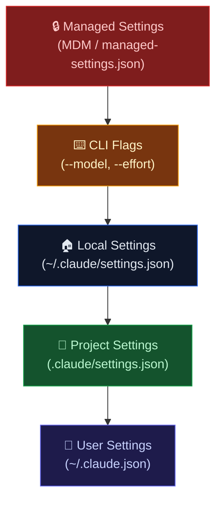

# Lab 020 - Sandboxing & Enterprise Configuration

!!! hint "Overview"

    - In this lab, you will learn how Claude Code sandboxing isolates bash commands from the filesystem and network.
    - You will configure filesystem rules (allow/deny read/write) and network rules (allowed domains, local binding).
    - You will set up managed settings for organizational control via MDM policies and managed-settings.json.
    - You will understand the settings precedence hierarchy and enterprise-grade controls.
    - By the end of this lab, you will have a fully sandboxed, enterprise-ready Claude Code configuration for the Elcon team.

## Prerequisites

- Claude Code installed and authenticated
- Labs 001-016 completed
- Understanding of permission modes (Lab 012)
- Admin access to a machine for managed settings (optional)

## What You Will Learn

- Enabling and configuring the sandbox
- Filesystem rules: allowWrite, denyWrite, denyRead, allowRead
- Network rules: allowedDomains, local binding, Unix sockets
- Managed settings for organizations (MDM, file-based)
- Settings precedence: managed > CLI > local > project > user
- Enterprise controls: forced login, model restrictions, attribution

---

## Background

## Settings Precedence



Higher levels always override lower levels. Managed settings cannot be overridden by any user or project configuration.

## Sandbox Configuration Options

| Setting                     | Type     | Description                                     |
| --------------------------- | -------- | ----------------------------------------------- |
| `sandbox.enabled`           | boolean  | Enable filesystem and network sandboxing        |
| `autoAllowBashIfSandboxed`  | boolean  | Auto-allow bash commands when sandbox is active |
| `sandbox.allowWrite`        | string[] | Paths where writes are permitted                |
| `sandbox.denyWrite`         | string[] | Paths where writes are blocked                  |
| `sandbox.denyRead`          | string[] | Paths that cannot be read                       |
| `sandbox.allowRead`         | string[] | Paths explicitly allowed for reading            |
| `sandbox.allowedDomains`    | string[] | Network domains the sandbox can reach           |
| `sandbox.allowLocalBinding` | boolean  | Allow binding to localhost ports                |
| `sandbox.allowUnixSockets`  | boolean  | Allow Unix socket connections                   |
| `sandbox.excludedCommands`  | string[] | Commands that bypass sandbox restrictions       |

## Path Prefix Conventions

| Prefix | Meaning               | Example            |
| ------ | --------------------- | ------------------ |
| `/`    | Absolute path         | `/etc/hosts`       |
| `~/`   | Home directory        | `~/Documents/`     |
| `./`   | Project-relative path | `./src/`, `./.env` |

---

## Lab Steps

## Step 1 - Enable Sandboxing

Enable the sandbox in `.claude/settings.json`:

```json
{
  "sandbox": {
    "enabled": true
  },
  "autoAllowBashIfSandboxed": true
}
```

With `autoAllowBashIfSandboxed`, Claude Code will not prompt for bash command approval - the sandbox handles safety.

## Step 2 - Configure Filesystem Rules

Restrict file access for the Elcon project:

```json
{
  "sandbox": {
    "enabled": true,
    "allowWrite": ["./src/", "./public/", "./supabase/migrations/", "./tests/"],
    "denyWrite": [
      "./.env",
      "./.env.production",
      "./supabase/config.toml",
      "~/.ssh/"
    ],
    "denyRead": ["./.env.production", "~/.ssh/", "~/.aws/"],
    "allowRead": ["./", "~/elcon-docs/"]
  }
}
```

## Step 3 - Configure Network Rules

Control which domains Claude Code can reach:

```json
{
  "sandbox": {
    "enabled": true,
    "allowedDomains": [
      "api.supabase.co",
      "*.supabase.co",
      "registry.npmjs.org",
      "api.github.com"
    ],
    "allowLocalBinding": true,
    "allowUnixSockets": false,
    "excludedCommands": ["git", "ssh-agent"]
  }
}
```

## Step 4 - Verify Sandbox with /status

Check that sandbox rules are active:

```bash
claude

# Inside the session:
/status
```

Output will show:

```
Sandbox: enabled
  Allowed write paths: ./src/, ./public/, ./supabase/migrations/, ./tests/
  Denied write paths: ./.env, ./.env.production, ./supabase/config.toml
  Denied read paths: ./.env.production, ~/.ssh/, ~/.aws/
  Allowed domains: api.supabase.co, *.supabase.co, registry.npmjs.org
```

## Step 5 - Managed Settings for Organizations

Create `/etc/claude/managed-settings.json` (requires admin access):

```json
{
  "forceLoginMethod": "oauth",
  "forceLoginOrgUUID": "org-elcon-12345-abcde",
  "availableModels": ["sonnet", "haiku"],
  "disableBypassPermissionsMode": true,
  "allowManagedPermissionRulesOnly": true,
  "sandbox": {
    "enabled": true,
    "denyRead": ["~/.ssh/", "~/.aws/", "~/.config/gcloud/"],
    "denyWrite": ["./.env*", "./secrets/"]
  },
  "companyAnnouncements": [
    "Reminder: All AI-generated code must be reviewed before merging.",
    "Use Supabase RLS for all new tables. See the Elcon wiki for details."
  ],
  "permissions": {
    "deny": ["Bash(rm -rf *)", "Bash(sudo *)", "Bash(curl * | bash)"]
  }
}
```

For modular configuration, use the `.d` directory:

```bash
# /etc/claude/managed-settings.d/sandbox.json
# /etc/claude/managed-settings.d/permissions.json
# /etc/claude/managed-settings.d/models.json
```

## Step 6 - macOS MDM Policies

For macOS deployment via MDM (Jamf, Mosyle, etc.):

```bash
# Deploy via plist
defaults write com.anthropic.claude \
  sandbox.enabled -bool true

defaults write com.anthropic.claude \
  disableBypassPermissionsMode -bool true

defaults write com.anthropic.claude \
  forceLoginOrgUUID -string "org-elcon-12345-abcde"
```

## Step 7 - Attribution Settings

Configure commit attribution for AI-generated code:

```json
{
  "attribution": {
    "commitTrailer": true,
    "trailerName": "Generated-by",
    "trailerValue": "Claude Code (Anthropic)",
    "prDescription": true,
    "prDescriptionTag": "<!-- claude-code-generated -->"
  }
}
```

This adds a trailer to every commit made by Claude Code:

```
feat: add supplier rating system

Generated-by: Claude Code (Anthropic)
```

---

## Tasks

!!! note "Task 1"
Enable sandboxing for the Elcon project. Allow writes only to `src/` and `tests/`. Deny reads to `.env.production` and `~/.ssh/`. Verify with `/status`.

!!! note "Task 2"
Create a `managed-settings.json` that forces OAuth login, restricts available models to sonnet and haiku, and disables bypass permissions mode. Test that project settings cannot override these.

!!! note "Task 3"
Configure network sandbox rules that allow only `*.supabase.co` and `registry.npmjs.org`. Set up commit attribution with a `Generated-by` trailer. Verify the trailer appears in a test commit.

---

## Summary

In this lab you:

- [x] Enabled sandbox isolation for bash commands
- [x] Configured filesystem rules with allow/deny read/write paths
- [x] Set up network rules with allowed domains and local binding
- [x] Created managed settings for organizational control
- [x] Understood the settings precedence hierarchy
- [x] Deployed policies via MDM and managed-settings.json
- [x] Configured commit attribution for AI-generated code
