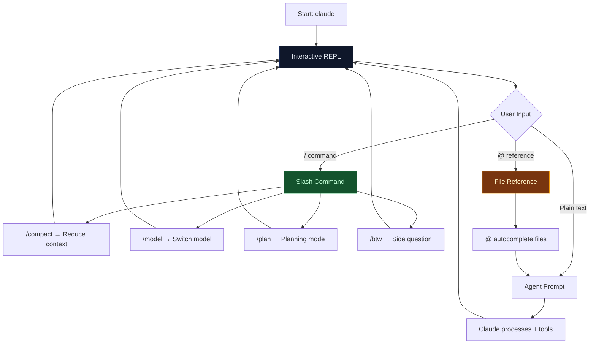

# Lab 021 - Interactive Mode Deep Dive

!!! hint "Overview"

    - In this lab, you will master Claude Code's interactive REPL with all slash commands and keyboard shortcuts.
    - You will manage context with `/compact`, `/focus`, and manual compaction strategies.
    - You will customize the terminal UI: vim bindings, fullscreen mode, spinner, and status line.
    - You will use voice dictation, deep links, file references, and plan mode for advanced workflows.
    - By the end of this lab, you will be fully productive in Claude Code's interactive environment for Elcon development.

## Prerequisites

- Claude Code installed and authenticated
- Labs 001-016 completed
- A terminal with Unicode support (iTerm2, Wezterm, or VS Code terminal)

## What You Will Learn

- All slash commands and their use cases
- Context management: compaction, focus mode
- Terminal UI customization: vim mode, fullscreen, spinners
- Voice dictation and external editor integration
- File references with `@` autocomplete
- Plan mode and effort level switching

---

## Background

## Interactive Session Workflow



## Slash Commands Reference

| Command           | Description                                      |
| ----------------- | ------------------------------------------------ |
| `/help`           | Show all available commands                      |
| `/config`         | Display current configuration and settings       |
| `/status`         | Show active model, permissions, plugins, sandbox |
| `/model`          | Switch to a different model mid-session          |
| `/effort`         | Set effort level: low, medium, high, xhigh, max  |
| `/clear`          | Clear conversation history and start fresh       |
| `/compact`        | Compress context to free up token space          |
| `/focus`          | Toggle clean output mode (hide tool details)     |
| `/resume`         | Resume a previous named session                  |
| `/rename`         | Rename the current session                       |
| `/btw`            | Ask a quick side question without using tools    |
| `/plan`           | Switch to planning mode (read-only)              |
| `/voice`          | Toggle push-to-talk voice dictation              |
| `/tui`            | Enter fullscreen terminal UI mode                |
| `/plugins`        | List installed and active plugins                |
| `/reload-plugins` | Reload plugin definitions after changes          |

---

## Lab Steps

## Step 1 - Essential Slash Commands

Start Claude Code and explore the command palette:

```bash
claude

# Show all commands
/help

# Check your current setup
/status

# View configuration details
/config
```

## Step 2 - Context Management with /compact

As conversations grow long, context fills up. Use `/compact` to compress:

```bash
# Manual compaction - summarizes the conversation so far
/compact

# Auto-compaction happens when context window is ~80% full
# You can continue working normally after compaction
```

Best practice for long Elcon development sessions:

```
> Add the supplier rating table migration
> ... (Claude creates migration)
> Now add the RPC functions
> ... (Claude adds functions)
/compact
> Now build the frontend rating component
```

## Step 3 - Focus Mode

Toggle focus mode for clean output without tool execution details:

```bash
# Enable focus mode
/focus

# Now prompts show only final results, not intermediate tool calls
> Show me the supplier table schema

# Disable focus mode to see full details again
/focus
```

## Step 4 - Side Questions with /btw

Ask quick questions that don't use tools or affect the conversation flow:

```bash
# Quick question without tool use
/btw What's the PostgreSQL syntax for UPSERT?

# Another side question
/btw How do I convert a timestamp to date in JS?
```

The `/btw` response is fast because it skips tool calls - useful for syntax lookups during implementation.

## Step 5 - Model and Effort Switching

Switch models and effort levels mid-session:

```bash
# Switch to a faster model for simple tasks
/model haiku

# Back to default for complex work
/model sonnet

# Set effort level
/effort low    # Quick answers, minimal exploration
/effort high   # Thorough analysis, deep exploration
/effort max    # Maximum quality, most tokens used
```

## Step 6 - Terminal UI Customization

Enable vim bindings for the input editor:

```bash
# In ~/.claude/settings.json
```

```json
{
  "editorMode": "vim",
  "spinnerVerbs": ["thinking", "analyzing", "coding", "reviewing"],
  "spinnerTipsEnabled": true,
  "spinnerTipsOverride": [
    "Tip: Use /compact to free up context space",
    "Tip: Press Ctrl+G to open your $EDITOR",
    "Tip: Use @filename for quick file references"
  ],
  "statusLine": "echo \"Elcon Dev | $(git branch --show-current)\"",
  "awaySummaryEnabled": true
}
```

Fullscreen terminal UI for focused work:

```bash
# Enter fullscreen TUI with virtualized scrollback
/tui

# Exit fullscreen with Esc or Ctrl+C
```

## Step 7 - External Editor and Keyboard Shortcuts

Open your system editor for complex multi-line prompts:

```bash
# Press Ctrl+G to open $EDITOR (vim, nano, code, etc.)
# Write your prompt, save, and close - it sends to Claude

# Set your preferred editor
export EDITOR="code --wait"
```

Key keyboard shortcuts:

| Shortcut    | Action                         |
| ----------- | ------------------------------ |
| `Enter`     | Send the current prompt        |
| `Shift+Tab` | Cycle permission modes         |
| `Ctrl+G`    | Open external editor for input |
| `Ctrl+C`    | Cancel current operation       |
| `Ctrl+D`    | Exit Claude Code               |
| `Up/Down`   | Navigate prompt history        |
| `Tab`       | Autocomplete file references   |

## Step 8 - File References and Deep Links

Reference files directly in prompts:

```bash
# @ autocomplete - type @ then start typing
> Explain @src/js/suppliers.js

# Multiple file references
> Compare @src/js/auth.js and @src/js/suppliers.js

# Deep links to open Claude Code with a pre-filled query
# claude-cli://open?q=Review%20the%20supplier%20module
```

## Step 9 - Plan Mode

Switch to planning mode for architecture and design work:

```bash
# Enter plan mode (read-only, no edits)
/plan

# Claude will analyze and plan but not modify files
> Design a notification system for supplier order updates

# Exit plan mode to implement
/plan
```

## Step 10 - Session Management

Name, resume, and manage sessions:

```bash
# Rename current session
/rename elcon-rating-feature

# Resume later
claude --resume elcon-rating-feature

# List all sessions
claude sessions list
```

Enable away summaries to get a recap when returning:

```json
{
  "awaySummaryEnabled": true
}
```

When you resume a session, Claude provides a summary of what happened and where you left off.

---

## Tasks

!!! note "Task 1"
Start a session, have a 5-message conversation about the Elcon supplier module, then use `/compact` to compress context. Verify the session continues working correctly after compaction.

!!! note "Task 2"
Configure vim editor mode, custom spinner tips, and a status line that shows the current git branch. Enable away summaries. Verify all settings with `/config`.

!!! note "Task 3"
Use `/plan` mode to design a supplier notification system. Switch to `/model opus` for the design phase, then exit plan mode and switch to `/model sonnet` for implementation. Use `/btw` for any quick syntax questions along the way.

---

## Summary

In this lab you:

- [x] Mastered all slash commands: /help, /compact, /focus, /btw, /plan, /model, /effort
- [x] Managed context with /compact and auto-compaction strategies
- [x] Customized the terminal UI: vim mode, spinners, status line, fullscreen TUI
- [x] Used voice dictation and external editor integration
- [x] Referenced files with @ autocomplete and deep links
- [x] Switched models and effort levels mid-session for optimal performance
- [x] Managed sessions with naming, resuming, and away summaries
