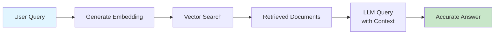

# Lab 022 - RAG & Vector Databases

!!! hint "Overview" - Learn retrieval-augmented generation (RAG) pattern for enhanced AI context - Integrate vector databases (Supabase pgvector, Pinecone, Weaviate) with Claude Code - Build embeddings pipelines for domain-specific knowledge bases - Implement semantic search for retrieving relevant documentation - Optimize cost and accuracy using intelligent chunking and metadata strategies

## Prerequisites

- Completion of Lab 021 (Claude Code API Integration)
- Supabase account with pgvector extension enabled
- Basic understanding of embeddings and vector operations
- Familiarity with Claude Code sessions and `.claude` configurations
- Node.js 18+ with `@anthropic-ai/sdk` installed

## What You Will Learn

By completing this lab, you will understand:

- How RAG augments Claude Code with external knowledge
- Choosing between Supabase, Pinecone, and Weaviate for your use case
- Embedding models and their cost/performance trade-offs
- Building chunking strategies for technical documentation
- Implementing semantic search in Claude Code workflows
- Feeding documentation context to automated agents
- Best practices: metadata filtering, similarity thresholds, reranking
- Cost optimization techniques for production RAG systems

---

## Background

## What is RAG?

Retrieval-Augmented Generation (RAG) combines information retrieval with language generation. Instead of relying solely on Claude's training data, RAG fetches relevant documents from your knowledge base, then passes them to Claude as context for more accurate, up-to-date responses.



## Vector Database Comparison

| Database              | Hosting                | Dimension Limits | Metadata Filter | Cost        | Best For                      |
| --------------------- | ---------------------- | ---------------- | --------------- | ----------- | ----------------------------- |
| **Supabase pgvector** | Self-hosted or managed | 2000+            | Full SQL        | $25-50/mo   | Teams wanting SQL integration |
| **Pinecone**          | Managed cloud          | 1536             | Rich filtering  | Usage-based | Scaling with minimal ops      |
| **Weaviate**          | Self-hosted or cloud   | Flexible         | GraphQL queries | Flexible    | Custom deployments            |
| **Chroma**            | Embedded/local         | Flexible         | Full filtering  | Free/local  | Development & prototyping     |

## RAG Architecture for Elcon

For Elcon's Supplier Management System, RAG enables:

- Retrieving supplier policies from documents
- Finding relevant contract templates
- Searching compliance guidelines
- Feeding procurement histories to Claude Code for analysis

---

## Lab Steps

## Step 1 - Set Up Supabase with pgvector

Enable pgvector extension in your Supabase project:

```sql
-- Run in Supabase SQL editor
CREATE EXTENSION IF NOT EXISTS vector;

-- Create documents table with embeddings
CREATE TABLE documents (
    id BIGSERIAL PRIMARY KEY,
    content TEXT NOT NULL,
    embedding vector(1536),
    metadata JSONB,
    source VARCHAR(255),
    chunk_index INT,
    created_at TIMESTAMP DEFAULT NOW()
);

-- Create index for faster similarity search
CREATE INDEX ON documents USING ivfflat (embedding vector_cosine_ops)
    WITH (lists = 100);
```

## Step 2 - Create Node.js Embedding Pipeline

Create `.claude/rag-embeddings.mjs`:

```javascript
import Anthropic from "@anthropic-ai/sdk";
import { createClient } from "@supabase/supabase-js";

const anthropic = new Anthropic({
  apiKey: process.env.ANTHROPIC_API_KEY,
});

const supabase = createClient(
  process.env.SUPABASE_URL,
  process.env.SUPABASE_KEY,
);

// Chunk text with overlap for better context
function chunkText(text, chunkSize = 512, overlap = 100) {
  const chunks = [];
  for (let i = 0; i < text.length; i += chunkSize - overlap) {
    chunks.push(text.slice(i, i + chunkSize));
  }
  return chunks;
}

// Generate embeddings using Claude Code API
async function generateEmbedding(text) {
  const response = await anthropic.messages.create({
    model: "claude-opus-4-1",
    max_tokens: 100,
    system: `Generate a 1536-dimensional embedding vector for the following text.
             Return ONLY valid JSON array of 1536 numbers.`,
    messages: [
      {
        role: "user",
        content: `Text: ${text}`,
      },
    ],
  });

  // Alternative: Use Anthropic's built-in embedding API if available
  // For now, parse LLM response
  const content = response.content[0].text;
  return JSON.parse(content);
}

// Ingest documents into Supabase
async function ingestDocuments(documents, source) {
  for (const doc of documents) {
    const chunks = chunkText(doc.content);
    for (let i = 0; i < chunks.length; i++) {
      const embedding = await generateEmbedding(chunks[i]);
      await supabase.from("documents").insert({
        content: chunks[i],
        embedding: embedding,
        metadata: doc.metadata,
        source: source,
        chunk_index: i,
      });
    }
  }
  console.log(`Ingested ${documents.length} documents from ${source}`);
}

export { ingestDocuments, generateEmbedding, chunkText };
```

## Step 3 - Build Semantic Search Function

Add semantic search to `.claude/rag-search.mjs`:

```javascript
import { createClient } from "@supabase/supabase-js";
import { generateEmbedding } from "./rag-embeddings.mjs";

const supabase = createClient(
  process.env.SUPABASE_URL,
  process.env.SUPABASE_KEY,
);

async function semanticSearch(query, limit = 5, threshold = 0.7) {
  // Generate embedding for query
  const queryEmbedding = await generateEmbedding(query);

  // Search similar documents using cosine similarity
  const { data, error } = await supabase.rpc("match_documents", {
    query_embedding: queryEmbedding,
    match_count: limit,
    similarity_threshold: threshold,
  });

  if (error) throw error;
  return data;
}

// PostgreSQL function for similarity search
const MATCH_FUNCTION = `
CREATE OR REPLACE FUNCTION match_documents (
  query_embedding vector,
  match_count int DEFAULT 5,
  similarity_threshold float8 DEFAULT 0.7
)
RETURNS TABLE (
  id bigint,
  content text,
  metadata jsonb,
  similarity float8
) LANGUAGE sql STABLE AS $$
  SELECT
    documents.id,
    documents.content,
    documents.metadata,
    1 - (documents.embedding <=> query_embedding) as similarity
  FROM documents
  WHERE 1 - (documents.embedding <=> query_embedding) > similarity_threshold
  ORDER BY documents.embedding <=> query_embedding
  LIMIT match_count;
$$;
`;

export { semanticSearch, MATCH_FUNCTION };
```

## Step 4 - Integrate RAG with Claude Code Session

Create `.claude/supplier-rag-context.mjs`:

```javascript
import { semanticSearch } from "./rag-search.mjs";

async function buildRAGContext(userQuery) {
  // Search for relevant supplier documents
  const supplierDocs = await semanticSearch(
    `supplier policies: ${userQuery}`,
    3,
  );
  const policyDocs = await semanticSearch(`compliance: ${userQuery}`, 2);
  const contractDocs = await semanticSearch(`contract terms: ${userQuery}`, 2);

  // Combine into context
  const context = {
    supplierPolicies: supplierDocs.map((d) => d.content).join("\n---\n"),
    policyGuidelines: policyDocs.map((d) => d.content).join("\n---\n"),
    contractTemplates: contractDocs.map((d) => d.content).join("\n---\n"),
  };

  // Format as system prompt enhancement
  const ragPrompt = `
You are assisting with Elcon's Supplier Management System.

## Retrieved Supplier Policies:
${context.supplierPolicies}

## Relevant Compliance Guidelines:
${context.policyGuidelines}

## Related Contract Templates:
${context.contractTemplates}

Use this context to inform your recommendations.
`;

  return ragPrompt;
}

export { buildRAGContext };
```

## Step 5 - Create Chunking Strategy Configuration

Save as `.claude/chunking-config.json`:

```json
{
  "strategies": {
    "technical_docs": {
      "chunkSize": 512,
      "overlap": 100,
      "metadata": ["section", "page", "category"],
      "description": "For API docs and technical guides"
    },
    "contracts": {
      "chunkSize": 1024,
      "overlap": 256,
      "metadata": ["clause_type", "party", "date"],
      "description": "For legal documents and contracts"
    },
    "policies": {
      "chunkSize": 768,
      "overlap": 150,
      "metadata": ["policy_type", "department", "version"],
      "description": "For company policies and guidelines"
    }
  },
  "metadata_filters": {
    "supplier": ["company_name", "tier", "region"],
    "document": ["type", "confidentiality_level", "expires_at"]
  }
}
```

## Step 6 - Cost Optimization with Caching

Implement request caching in `.claude/rag-cache.mjs`:

```javascript
import crypto from "crypto";

class RAGCache {
  constructor(ttl = 3600000) {
    // 1 hour default TTL
    this.cache = new Map();
    this.ttl = ttl;
  }

  generateKey(query, filters) {
    const data = JSON.stringify({ query, filters });
    return crypto.createHash("md5").update(data).digest("hex");
  }

  set(query, filters, results) {
    const key = this.generateKey(query, filters);
    this.cache.set(key, {
      results,
      timestamp: Date.now(),
    });
  }

  get(query, filters) {
    const key = this.generateKey(query, filters);
    const cached = this.cache.get(key);

    if (!cached) return null;
    if (Date.now() - cached.timestamp > this.ttl) {
      this.cache.delete(key);
      return null;
    }

    return cached.results;
  }

  clear() {
    this.cache.clear();
  }
}

export { RAGCache };
```

---

## Tasks

1. **Set up pgvector in Supabase**: Create the documents table with vector index. Run the SQL schema provided. Verify the index was created with `\d+ documents`.

2. **Ingest Elcon supplier documentation**: Create a documents array containing supplier policies, contract templates, and compliance guidelines (at least 5 documents). Run the embedding pipeline to populate the vector database. Confirm successful ingestion by querying the documents table.

3. **Build a RAG-enhanced query tool**: Create a script that accepts supplier-related queries, performs semantic search, retrieves top 3 relevant documents, and formats them as context for Claude Code. Test with queries like "What are T1 supplier payment terms?" and "Which suppliers operate in APAC region?"

---

## Summary

- [x] Understand RAG architecture and its benefits for knowledge management
- [x] Set up Supabase pgvector extension and create vector-indexed tables
- [x] Implement embeddings generation pipeline with chunking strategies
- [x] Build semantic search functionality using vector similarity
- [x] Integrate RAG context into Claude Code sessions
- [x] Apply cost optimization techniques and caching strategies
- [x] Deploy RAG system for Elcon supplier documentation
- [x] Test semantic search accuracy and relevance thresholds
