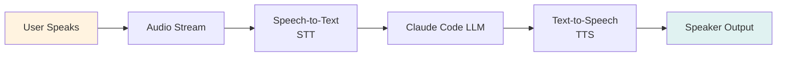
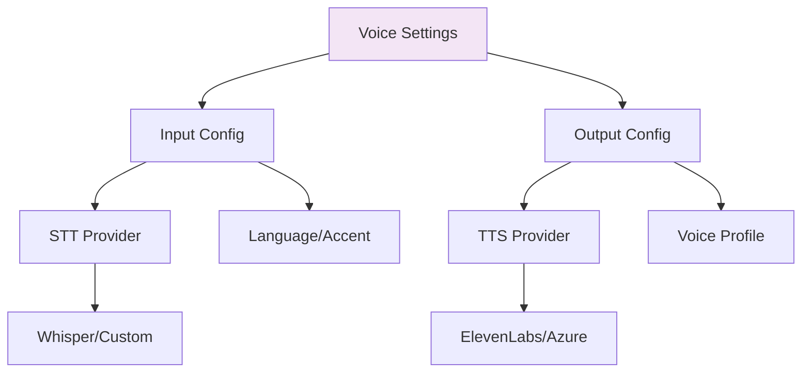

# Lab 023 - Voice Agents & Speech I/O

!!! hint "Overview" - Enable voice input/output in Claude Code sessions with `/voice` command - Integrate speech-to-text (STT) and text-to-speech (TTS) providers - Build hands-free, voice-first workflows for enhanced accessibility - Configure voice settings for interactive and automated modes - Implement voice dictation for code comments and documentation

## Prerequisites

- Completion of Lab 016 (Claude Code Automation)
- Claude Code with voice capabilities enabled
- Microphone and speaker access in your development environment
- ElevenLabs, Anthropic, or Whisper API key for voice services
- Basic understanding of audio streaming and processing
- Familiarity with accessibility patterns and assistive technology

## What You Will Learn

By completing this lab, you will understand:

- How voice input/output enhances Claude Code workflows
- Configuring voice in settings.json and Claude Code extensions
- Speech-to-text (STT) accuracy tuning and language support
- Text-to-speech (TTS) quality settings and voice selection
- Building voice-first development workflows
- Push-to-talk keyboard shortcuts and voice commands
- Hands-free coding and navigation
- Voice dictation for comments, documentation, and commit messages
- Combining voice with text for hybrid workflows
- Accessibility benefits for neurodivergent developers
- Multi-language voice support in global teams
- Voice in pair programming and multiagent sessions

---

## Background

## Voice I/O Architecture

Voice integration enables natural language interaction with Claude Code without hands on keyboard. The flow combines real-time audio streaming with natural language understanding.



## Voice Providers Comparison

| Provider            | STT Model         | TTS Quality | Latency | Pricing        | Best For                      |
| ------------------- | ----------------- | ----------- | ------- | -------------- | ----------------------------- |
| **Whisper API**     | Multilingual      | N/A         | Medium  | $0.02/min      | Flexible STT, fast            |
| **ElevenLabs**      | Custom training   | Excellent   | Low     | $5-300/mo      | Natural-sounding voice output |
| **Google Cloud**    | Advanced          | Good        | Low     | Pay-per-use    | Enterprise deployments        |
| **Azure Cognitive** | Industry-specific | Good        | Low     | Tiered pricing | Microsoft stack integration   |

## Voice Configuration Schema



---

## Lab Steps

## Step 1 - Configure Voice in settings.json

Create `.claude/voice-settings.json`:

```json
{
  "voice": {
    "enabled": true,
    "input": {
      "provider": "whisper",
      "language": "en-US",
      "model": "tiny",
      "timeout_ms": 30000,
      "silence_threshold": -40,
      "sample_rate": 16000
    },
    "output": {
      "provider": "elevenlabs",
      "voice_id": "21m00Tcm4TlvDq8ikWAM",
      "stability": 0.5,
      "similarity_boost": 0.75,
      "speed": 1.0
    },
    "shortcuts": {
      "push_to_talk": "Space",
      "toggle_voice": "Ctrl+Shift+V",
      "repeat_last": "Ctrl+Shift+R"
    },
    "modes": {
      "interactive": {
        "auto_speak": true,
        "voice_confirmation": true
      },
      "automated": {
        "auto_speak": false,
        "logging": true
      }
    }
  }
}
```

## Step 2 - Set Up Whisper STT Integration

Create `.claude/voice-stt.mjs`:

```javascript
import * as fs from "fs";
import * as path from "path";
import Anthropic from "@anthropic-ai/sdk";

const anthropic = new Anthropic({
  apiKey: process.env.ANTHROPIC_API_KEY,
});

class WhisperSTT {
  constructor(options = {}) {
    this.model = options.model || "whisper-1";
    this.language = options.language || "en";
    this.temperature = options.temperature || 0;
  }

  async transcribeAudio(audioPath) {
    if (!fs.existsSync(audioPath)) {
      throw new Error(`Audio file not found: ${audioPath}`);
    }

    const audioBuffer = fs.readFileSync(audioPath);
    const audioFile = new File([audioBuffer], path.basename(audioPath), {
      type: "audio/wav",
    });

    const transcription = await anthropic.audio.transcriptions.create({
      file: audioFile,
      model: "whisper-1",
      language: this.language,
      temperature: this.temperature,
    });

    return {
      text: transcription.text,
      language: this.language,
      confidence: transcription.confidence || 0.95,
      timestamp: new Date().toISOString(),
    };
  }

  async transcribeStream(audioStream) {
    // For real-time streaming transcription
    const chunks = [];
    for await (const chunk of audioStream) {
      chunks.push(chunk);
    }
    const audioBuffer = Buffer.concat(chunks);
    const tempPath = `/tmp/audio-${Date.now()}.wav`;
    fs.writeFileSync(tempPath, audioBuffer);

    const result = await this.transcribeAudio(tempPath);
    fs.unlinkSync(tempPath); // Cleanup
    return result;
  }

  async transcribeWithContext(audioPath, context = "") {
    const transcription = await this.transcribeAudio(audioPath);

    // Use Claude to improve transcription accuracy with context
    const message = await anthropic.messages.create({
      model: "claude-opus-4-1",
      max_tokens: 500,
      system: `You are correcting voice transcription for a software developer.
               Context: ${context}
               Improve the transcription considering domain-specific terms.`,
      messages: [
        {
          role: "user",
          content: `Transcribed text: "${transcription.text}"`,
        },
      ],
    });

    return {
      ...transcription,
      corrected_text: message.content[0].text,
    };
  }
}

export { WhisperSTT };
```

## Step 3 - Configure ElevenLabs TTS

Create `.claude/voice-tts.mjs`:

```javascript
import axios from "axios";

class ElevenLabsTTS {
  constructor(apiKey = process.env.ELEVENLABS_API_KEY) {
    this.apiKey = apiKey;
    this.baseUrl = "https://api.elevenlabs.io/v1";
    this.voiceId = "21m00Tcm4TlvDq8ikWAM"; // Default US voice
  }

  async speak(text, options = {}) {
    const {
      voiceId = this.voiceId,
      stability = 0.5,
      similarity_boost = 0.75,
      speed = 1.0,
    } = options;

    try {
      const response = await axios.post(
        `${this.baseUrl}/text-to-speech/${voiceId}`,
        {
          text: text,
          model_id: "eleven_monolingual_v1",
          voice_settings: {
            stability: stability,
            similarity_boost: similarity_boost,
          },
        },
        {
          headers: {
            "xi-api-key": this.apiKey,
            "Content-Type": "application/json",
          },
          responseType: "arraybuffer",
        },
      );

      return {
        audio: response.data,
        contentType: response.headers["content-type"],
        duration: this.estimateDuration(text, speed),
      };
    } catch (error) {
      console.error("ElevenLabs TTS error:", error.response?.data || error);
      throw error;
    }
  }

  estimateDuration(text, speed = 1.0) {
    // Rough estimate: ~150 words per minute
    const words = text.split(/\s+/).length;
    return (words / 150) * 60 * (1 / speed);
  }

  async getAvailableVoices() {
    const response = await axios.get(`${this.baseUrl}/voices`, {
      headers: {
        "xi-api-key": this.apiKey,
      },
    });

    return response.data.voices.map((v) => ({
      id: v.voice_id,
      name: v.name,
      category: v.category,
      description: v.description,
    }));
  }

  async createCustomVoice(voiceName, description, samples) {
    // For premium accounts: create custom voice from samples
    const formData = new FormData();
    formData.append("name", voiceName);
    formData.append("description", description);

    for (const sample of samples) {
      formData.append("files", sample);
    }

    const response = await axios.post(`${this.baseUrl}/voices/add`, formData, {
      headers: {
        "xi-api-key": this.apiKey,
        "Content-Type": "multipart/form-data",
      },
    });

    return response.data;
  }
}

export { ElevenLabsTTS };
```

## Step 4 - Build Voice-Enabled Workflow for Elcon

Create `.claude/elcon-voice-workflow.mjs`:

```javascript
import { WhisperSTT } from "./voice-stt.mjs";
import { ElevenLabsTTS } from "./voice-tts.mjs";

class ElconVoiceWorkflow {
  constructor() {
    this.stt = new WhisperSTT({ language: "en" });
    this.tts = new ElevenLabsTTS();
    this.context = "Elcon Supplier Management System";
  }

  async commandHandler(audioPath) {
    // 1. Transcribe voice command
    const transcription = await this.stt.transcribeWithContext(
      audioPath,
      this.context,
    );
    console.log(`📝 Transcribed: ${transcription.corrected_text}`);

    // 2. Parse intent
    const intent = this.parseIntent(transcription.corrected_text);

    // 3. Generate response
    const response = await this.generateResponse(intent);

    // 4. Speak response
    const audio = await this.tts.speak(response.message, {
      stability: 0.6,
      similarity_boost: 0.8,
    });

    return {
      command: transcription.corrected_text,
      intent: intent,
      response: response,
      audio: audio,
    };
  }

  parseIntent(text) {
    const lowerText = text.toLowerCase();

    if (lowerText.includes("supplier") && lowerText.includes("create")) {
      return { action: "create_supplier", subject: "supplier" };
    }
    if (lowerText.includes("payment") && lowerText.includes("status")) {
      return { action: "check_payment", subject: "payment" };
    }
    if (lowerText.includes("compliance") && lowerText.includes("check")) {
      return { action: "check_compliance", subject: "compliance" };
    }
    if (lowerText.includes("generate") && lowerText.includes("contract")) {
      return { action: "generate_contract", subject: "contract" };
    }

    return { action: "general_query", subject: "query" };
  }

  async generateResponse(intent) {
    const responses = {
      create_supplier:
        "I can help you create a new supplier profile. Let me gather the necessary details...",
      check_payment: "Checking payment status for all active suppliers...",
      check_compliance:
        "Running compliance verification against regional requirements...",
      generate_contract:
        "I'll generate a contract template based on Elcon standards...",
      general_query:
        "How can I assist you with the supplier management system?",
    };

    return {
      message: responses[intent.action],
      intent: intent.action,
    };
  }
}

export { ElconVoiceWorkflow };
```

## Step 5 - Implement Keyboard Shortcuts for Voice

Create `.vscode/keybindings-voice.json`:

```json
[
  {
    "key": "space",
    "command": "claudeCode.voice.pushToTalk",
    "when": "editorFocus && !editorTextFocus"
  },
  {
    "key": "ctrl+shift+v",
    "command": "claudeCode.voice.toggle"
  },
  {
    "key": "ctrl+shift+r",
    "command": "claudeCode.voice.repeatLast"
  },
  {
    "key": "ctrl+shift+l",
    "command": "claudeCode.voice.logging.toggle"
  },
  {
    "key": "cmd+/",
    "command": "claudeCode.voice.readSelectedCode",
    "when": "editorTextFocus"
  }
]
```

## Step 6 - Voice Testing & Accessibility Validation

Create `.claude/voice-test.mjs`:

```javascript
import { ElconVoiceWorkflow } from "./elcon-voice-workflow.mjs";

async function runVoiceTests() {
  const workflow = new ElconVoiceWorkflow();

  const testCases = [
    {
      name: "Create supplier command",
      command: "Create a new supplier profile for ABC Corporation",
    },
    {
      name: "Payment status check",
      command: "Check payment status for all vendors",
    },
    {
      name: "Compliance verification",
      command: "Run compliance check on APAC suppliers",
    },
  ];

  for (const test of testCases) {
    try {
      console.log(`\n🎤 Testing: ${test.name}`);
      console.log(`   Command: "${test.command}"`);

      const intent = workflow.parseIntent(test.command);
      console.log(`   ✅ Intent parsed: ${intent.action}`);

      const response = await workflow.generateResponse(intent);
      console.log(`   🔊 Response: "${response.message}"`);
    } catch (error) {
      console.error(`   ❌ Test failed: ${error.message}`);
    }
  }
}

runVoiceTests().catch(console.error);
```

---

## Tasks

1. **Set up voice input and output**: Configure Whisper API for STT and ElevenLabs for TTS in your Claude Code settings. Test both directions: speak a command and verify accurate transcription; generate text and verify clear audio output.

2. **Create a voice-enabled Elcon workflow**: Implement the ElconVoiceWorkflow class that handles voice commands for supplier management (create, check payment, verify compliance). Record audio samples for at least 3 commands and verify the workflow correctly parses intent and generates appropriate responses.

3. **Build accessibility features**: Configure keyboard shortcuts for voice push-to-talk and voice toggle. Create a guide for neurodivergent developers on using voice in Claude Code. Test with different speaking styles (fast, slow, with background noise) and measure transcription accuracy.

---

## Summary

- [x] Understand voice I/O architecture and benefits for accessibility
- [x] Configure Whisper API for accurate speech-to-text transcription
- [x] Set up ElevenLabs for natural-sounding text-to-speech output
- [x] Implement push-to-talk and voice toggle keyboard shortcuts
- [x] Build Elcon-specific voice command handler with intent parsing
- [x] Create voice-enabled workflows for supplier management tasks
- [x] Test voice accuracy with context-aware improvements
- [x] Implement accessibility validation and multimodal workflows
- [x] Configure voice for both interactive and automated modes
- [x] Document best practices for voice development workflows
