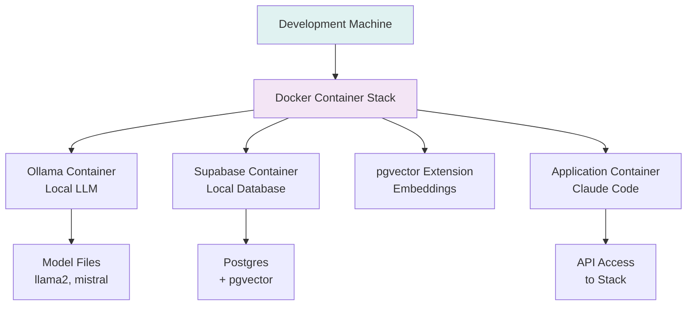
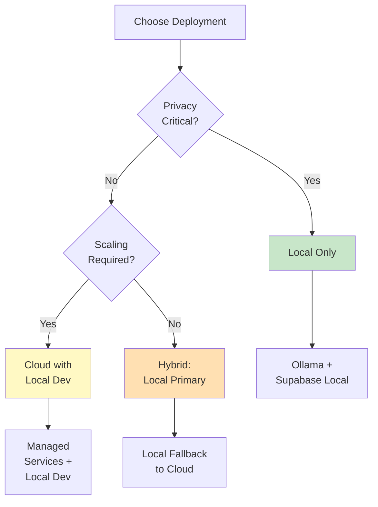

# Lab 024 - Local AI Deployment

!!! hint "Overview" - Deploy Claude Code and LLMs locally using Ollama, LM Studio, or local containers - Run Supabase and vector databases in isolated Docker environments - Balance privacy, cost, and performance with local vs cloud deployments - Configure offline-first applications for enterprise environments - Implement model selection strategies for different hardware configurations

## Prerequisites

- Docker and Docker Compose installed (20.10+)
- Minimum 8GB RAM; 16GB+ recommended for optimal performance
- GPU support (NVIDIA CUDA or Apple Metal) for faster inference
- Familiarity with container orchestration and networking
- Basic understanding of LLM model selection
- Completed Lab 016 (Claude Code Automation)

## What You Will Learn

By completing this lab, you will understand:

- Running LLMs locally with Ollama and LM Studio
- Container orchestration for complete AI stacks
- Model selection: performance, size, and capability trade-offs
- Local Supabase and pgvector deployment
- Resource optimization for constrained environments
- Privacy and security in local deployments
- Offline-first application architecture
- Combining local models with cloud APIs
- Cost analysis: local vs managed cloud deployments
- Enterprise sandboxing patterns
- Model quantization for resource-constrained hardware
- Health checks and monitoring for local stacks

---

## Background

## Local AI Stack Architecture

Running everything locally provides complete control, privacy, and cost predictability. The stack combines open-source LLMs, vector databases, and development tools in containerized environments.



## Local Model Comparison

| Model           | Size  | RAM Required | Speed     | Quality   | Best For              |
| --------------- | ----- | ------------ | --------- | --------- | --------------------- |
| **Mistral 7B**  | 4GB   | 8GB+         | Fast      | High      | General coding tasks  |
| **Llama 2 7B**  | 4GB   | 8GB+         | Fast      | High      | Balanced performance  |
| **Neural Chat** | 6GB   | 12GB+        | Medium    | High      | Instruction-following |
| **CodeLlama**   | 13GB  | 20GB+        | Slow      | Excellent | Code generation       |
| **Phi 2**       | 2.7GB | 6GB+         | Very Fast | Good      | Lightweight tasks     |

## Deployment Topology Decision Tree



---

## Lab Steps

## Step 1 - Install Ollama and Pull Models

Create install script `scripts/install-ollama.sh`:

```bash
#!/bin/bash
set -e

echo "🤖 Installing Ollama..."

# macOS Installation
if [[ "$OSTYPE" == "darwin"* ]]; then
    if command -v ollama &> /dev/null; then
        echo "✅ Ollama already installed"
    else
        curl -fsSL https://ollama.ai/install.sh | sh
    fi
fi

# Linux Installation
if [[ "$OSTYPE" == "linux-gnu"* ]]; then
    curl -fsSL https://ollama.ai/install.sh | sh
fi

echo "✅ Ollama installed"

# Start Ollama daemon
echo "🚀 Starting Ollama daemon..."
ollama serve &

# Wait for Ollama to be ready
sleep 5

# Pull models
echo "📥 Pulling models (this may take a while)..."
ollama pull mistral
ollama pull llama2
ollama pull neural-chat

echo "✅ Models downloaded successfully"
ollama list
```

## Step 2 - Docker Compose for Complete Local Stack

Create `docker-compose-local.yml`:

```yaml
version: "3.9"

services:
  # Local LLM with Ollama
  ollama:
    image: ollama/ollama:latest
    container_name: local-ollama
    environment:
      - OLLAMA_HOST=0.0.0.0:11434
    ports:
      - "11434:11434"
    volumes:
      - ollama_data:/root/.ollama
    networks:
      - local-ai
    healthcheck:
      test: ["CMD", "curl", "-f", "http://localhost:11434"]
      interval: 30s
      timeout: 10s
      retries: 3

  # Local Supabase (Postgres + pgvector)
  postgres:
    image: postgres:15-alpine
    container_name: local-postgres
    environment:
      POSTGRES_DB: elcon_local
      POSTGRES_USER: elcon_dev
      POSTGRES_PASSWORD: dev_password_123
    ports:
      - "5432:5432"
    volumes:
      - postgres_data:/var/lib/postgresql/data
      - ./scripts/init-pgvector.sql:/docker-entrypoint-initdb.d/01-pgvector.sql
    networks:
      - local-ai
    healthcheck:
      test: ["CMD-SHELL", "pg_isready -U elcon_dev"]
      interval: 10s
      timeout: 5s
      retries: 5

  # pgAdmin for database management
  pgadmin:
    image: dpage/pgadmin4:latest
    container_name: local-pgadmin
    environment:
      PGADMIN_DEFAULT_EMAIL: admin@elcon.local
      PGADMIN_DEFAULT_PASSWORD: admin123
    ports:
      - "5050:80"
    depends_on:
      - postgres
    networks:
      - local-ai

  # Chroma vector database (alternative to pgvector)
  chroma:
    image: ghcr.io/chroma-core/chroma:latest
    container_name: local-chroma
    ports:
      - "8000:8000"
    volumes:
      - chroma_data:/chroma/data
    networks:
      - local-ai
    environment:
      - CHROMA_DB_IMPL=duckdb+parquet
      - PERSIST_DIRECTORY=/chroma/data
    healthcheck:
      test: ["CMD", "curl", "-f", "http://localhost:8000/api/v1/heartbeat"]
      interval: 30s
      timeout: 10s
      retries: 3

  # Milvus vector database (high-performance alternative)
  milvus:
    image: milvusdb/milvus:v0.4.7
    container_name: local-milvus
    environment:
      COMMON_STORAGETYPE: local
    ports:
      - "19530:19530"
    volumes:
      - milvus_data:/var/lib/milvus
    networks:
      - local-ai
    healthcheck:
      test: ["CMD", "curl", "-f", "http://localhost:19530/healthz"]
      interval: 30s
      timeout: 10s
      retries: 3

networks:
  local-ai:
    driver: bridge

volumes:
  ollama_data:
  postgres_data:
  chroma_data:
  milvus_data:
```

## Step 3 - Initialize pgvector in PostgreSQL

Create `scripts/init-pgvector.sql`:

```sql
-- Enable pgvector extension
CREATE EXTENSION IF NOT EXISTS vector;

-- Create schema for Elcon data
CREATE SCHEMA IF NOT EXISTS elcon;

-- Documents table for RAG
CREATE TABLE IF NOT EXISTS elcon.documents (
    id SERIAL PRIMARY KEY,
    content TEXT NOT NULL,
    embedding vector(768),
    metadata JSONB,
    source VARCHAR(255),
    created_at TIMESTAMP DEFAULT NOW()
);

-- Suppliers table
CREATE TABLE IF NOT EXISTS elcon.suppliers (
    id SERIAL PRIMARY KEY,
    name VARCHAR(255) NOT NULL,
    tier VARCHAR(10),
    region VARCHAR(50),
    embedding vector(768),
    created_at TIMESTAMP DEFAULT NOW()
);

-- Create indexes for fast similarity search
CREATE INDEX IF NOT EXISTS idx_documents_embedding
  ON elcon.documents USING ivfflat (embedding vector_cosine_ops)
  WITH (lists = 100);

CREATE INDEX IF NOT EXISTS idx_suppliers_embedding
  ON elcon.suppliers USING ivfflat (embedding vector_cosine_ops)
  WITH (lists = 50);

-- Create similarity search function
CREATE OR REPLACE FUNCTION elcon.similarity_search(
  query_embedding vector,
  table_name text,
  match_count int DEFAULT 5
)
RETURNS TABLE (
  id int,
  content text,
  metadata jsonb,
  similarity float8
) LANGUAGE plpgsql AS $$
BEGIN
  RETURN QUERY EXECUTE format(
    'SELECT id, content, metadata, 1 - (embedding <=> $1) as similarity
     FROM %I ORDER BY embedding <=> $1 LIMIT $2',
    table_name
  ) USING query_embedding, match_count;
END;
$$;

-- Grant permissions
GRANT USAGE ON SCHEMA elcon TO elcon_dev;
GRANT ALL ON ALL TABLES IN SCHEMA elcon TO elcon_dev;
```

## Step 4 - Client for Local Ollama Integration

Create `.claude/local-ollama-client.mjs`:

```javascript
import axios from "axios";

class OllamaClient {
  constructor(baseUrl = "http://localhost:11434") {
    this.baseUrl = baseUrl;
    this.client = axios.create({ baseURL: this.baseUrl });
  }

  async generate(prompt, model = "mistral", options = {}) {
    try {
      const response = await this.client.post("/api/generate", {
        model: model,
        prompt: prompt,
        stream: false,
        temperature: options.temperature || 0.7,
        top_p: options.top_p || 0.9,
        ...options,
      });

      return {
        response: response.data.response,
        model: response.data.model,
        created_at: response.data.created_at,
        done: response.data.done,
      };
    } catch (error) {
      console.error("Ollama generation failed:", error.message);
      throw error;
    }
  }

  async embeddings(text, model = "mistral") {
    try {
      const response = await this.client.post("/api/embeddings", {
        model: model,
        prompt: text,
      });

      return {
        embedding: response.data.embedding,
        model: response.data.model,
      };
    } catch (error) {
      console.error("Embedding generation failed:", error.message);
      throw error;
    }
  }

  async listModels() {
    try {
      const response = await this.client.get("/api/tags");
      return response.data.models || [];
    } catch (error) {
      console.error("Failed to list models:", error.message);
      return [];
    }
  }

  async pullModel(model) {
    try {
      const response = await this.client.post("/api/pull", { model: model });
      return response.data;
    } catch (error) {
      console.error(`Failed to pull model ${model}:`, error.message);
      throw error;
    }
  }

  async deleteModel(model) {
    try {
      await this.client.delete("/api/delete", { data: { model: model } });
      return { success: true, model: model };
    } catch (error) {
      console.error(`Failed to delete model ${model}:`, error.message);
      throw error;
    }
  }

  async healthCheck() {
    try {
      await this.client.get("/api/tags");
      return { healthy: true, status: "connected" };
    } catch {
      return { healthy: false, status: "disconnected" };
    }
  }
}

export { OllamaClient };
```

## Step 5 - Local PostgreSQL Connection Pool

Create `.claude/local-postgres-client.mjs`:

```javascript
import pg from "pg";

class LocalPostgresClient {
  constructor(config = {}) {
    this.config = {
      user: config.user || "elcon_dev",
      password: config.password || "dev_password_123",
      host: config.host || "localhost",
      port: config.port || 5432,
      database: config.database || "elcon_local",
    };

    this.pool = new pg.Pool(this.config);
  }

  async connect() {
    try {
      const client = await this.pool.connect();
      const result = await client.query("SELECT NOW()");
      client.release();
      console.log("✅ Connected to local PostgreSQL");
      return true;
    } catch (error) {
      console.error("❌ Failed to connect:", error.message);
      return false;
    }
  }

  async insertDocument(content, metadata, source) {
    const query = `
      INSERT INTO elcon.documents (content, metadata, source)
      VALUES ($1, $2, $3)
      RETURNING id;
    `;

    try {
      const result = await this.pool.query(query, [
        content,
        JSON.stringify(metadata),
        source,
      ]);
      return result.rows[0].id;
    } catch (error) {
      console.error("Insert failed:", error.message);
      throw error;
    }
  }

  async similaritySearch(embedding, limit = 5) {
    const query = `
      SELECT id, content, metadata, 1 - (embedding <=> $1) as similarity
      FROM elcon.documents
      ORDER BY embedding <=> $1
      LIMIT $2;
    `;

    try {
      const result = await this.pool.query(query, [embedding, limit]);
      return result.rows;
    } catch (error) {
      console.error("Search failed:", error.message);
      throw error;
    }
  }

  async close() {
    await this.pool.end();
    console.log("✅ Connection pool closed");
  }
}

export { LocalPostgresClient };
```

## Step 6 - Deploy and Health Check Script

Create `scripts/deploy-local-stack.sh`:

```bash
#!/bin/bash
set -e

echo "🚀 Deploying local AI stack..."

# Start Docker Compose
echo "📦 Starting Docker containers..."
docker-compose -f docker-compose-local.yml up -d

# Wait for services to be ready
echo "⏳ Waiting for services to be healthy..."
sleep 15

# Health checks
echo "🏥 Running health checks..."

# Check Ollama
if curl -s http://localhost:11434 > /dev/null; then
    echo "✅ Ollama: Ready"
    curl -s http://localhost:11434/api/tags | jq '.models[].name'
else
    echo "❌ Ollama: Failed"
fi

# Check PostgreSQL
if PGPASSWORD=dev_password_123 psql -h localhost -U elcon_dev -d elcon_local -c "SELECT 1" > /dev/null 2>&1; then
    echo "✅ PostgreSQL: Ready"
else
    echo "❌ PostgreSQL: Failed"
fi

# Check pgvector
if PGPASSWORD=dev_password_123 psql -h localhost -U elcon_dev -d elcon_local -c "CREATE EXTENSION IF NOT EXISTS vector;" > /dev/null 2>&1; then
    echo "✅ pgvector: Ready"
else
    echo "❌ pgvector: Failed"
fi

# Check Chroma
if curl -s http://localhost:8000/api/v1/heartbeat > /dev/null; then
    echo "✅ Chroma: Ready"
else
    echo "❌ Chroma: Failed"
fi

# Check pgAdmin
if curl -s http://localhost:5050 > /dev/null; then
    echo "✅ pgAdmin: Ready (http://localhost:5050)"
else
    echo "❌ pgAdmin: Failed"
fi

echo ""
echo "🎉 Local AI stack deployed successfully!"
echo ""
echo "📍 Service endpoints:"
echo "   - Ollama: http://localhost:11434"
echo "   - PostgreSQL: localhost:5432"
echo "   - pgAdmin: http://localhost:5050"
echo "   - Chroma: http://localhost:8000"
echo ""
echo "🛑 To stop the stack: docker-compose -f docker-compose-local.yml down"
```

---

## Tasks

1. **Deploy complete local stack**: Run the docker-compose file to start Ollama, PostgreSQL, pgvector, Chroma, and Milvus containers. Verify all services are healthy with provided health checks. Access pgAdmin to confirm database connectivity.

2. **Test Ollama integration**: Pull at least 3 models (mistral, llama2, neural-chat). Create a test script that sends prompts to Ollama for code generation tasks. Measure response time and quality compared to cloud APIs. Compare resource usage (CPU, memory) for each model.

3. **Build offline Elcon workflow**: Create a complete offline workflow that ingests supplier documents locally, generates embeddings with Ollama, stores them in local PostgreSQL with pgvector, and performs semantic search without any cloud API calls. Document cost savings vs managed services.

---

## Summary

- [x] Understand local AI deployment architecture and trade-offs
- [x] Install and configure Ollama with multiple model pulls
- [x] Set up Docker Compose stack with Postgres, pgvector, Chroma, Milvus
- [x] Initialize pgvector extension and create similarity search functions
- [x] Implement Ollama client with generate and embeddings endpoints
- [x] Create local PostgreSQL connection pool and query helpers
- [x] Deploy complete stack with automated health checks
- [x] Verify all services are running and accessible
- [x] Test offline-first workflows with local models
- [x] Document performance metrics and resource requirements
- [x] Compare local vs cloud deployment costs
- [x] Create disaster recovery and backup procedures
