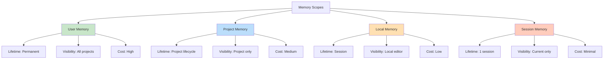
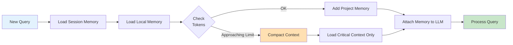

# Lab 026 - Advanced Memory & Context Management

!!! hint "Overview" - Understand memory scopes (user, project, local, session) and their trade-offs - Organize project knowledge in `.claude/memory/` directory structure - Implement context compaction strategies to stay within token limits - Build memory archival and cleanup workflows - Monitor and optimize memory usage across multiagent teams

## Prerequisites

- Completion of Lab 016 (Claude Code Automation)
- Understanding of token limits and context windows
- Familiarity with Claude Code memory files and `.claude` directory
- Basic knowledge of information architecture
- Supabase database setup for persistent memory
- Git for version control of memory artifacts

## What You Will Learn

By completing this lab, you will understand:

- Memory scopes: user, project, local, and session memory
- When to use each scope for optimal performance
- Memory file organization patterns and naming conventions
- Context window optimization and token budgeting
- The `/compact` command for automatic compaction
- Manual compaction strategies for large projects
- Privacy considerations in team memory sharing
- Performance implications of deep context hierarchies
- Clearing and archiving old or obsolete memory
- Memory in multiagent workflows and team settings
- Debugging memory issues and context loss
- Long-running session management techniques
- Cost analysis for different memory strategies

---

## Background

## Memory Scope Hierarchy

Claude Code provides four nested memory scopes, each with different lifetime, visibility, and performance characteristics.



## Memory Usage Patterns

| Scope       | Best For                                      | Typical Size | Retention           | Access Speed  |
| ----------- | --------------------------------------------- | ------------ | ------------------- | ------------- |
| **User**    | Coding preferences, reusable patterns         | 50-200KB     | Permanent           | Fast (cached) |
| **Project** | Architecture docs, API contracts, conventions | 500KB-5MB    | Project lifetime    | Medium        |
| **Local**   | Current feature context, TODOs, scratch       | 50-100KB     | Session             | Very fast     |
| **Session** | Conversation history, temporary state         | 100-500KB    | Single conversation | Instant       |

## Context Window Management Strategy



---

## Lab Steps

## Step 1 - Memory Directory Structure

Create `.claude/memory/` directory with organized structure:

```yaml
# Create file: .claude/memory/README.md
# Memory Organization Guide for Elcon Supplier Management

## Directory Structure
```

.claude/memory/
├── README.md # This file
├── architecture/
│ ├── system-overview.md # High-level system design
│ ├── database-schema.md # Supabase schema and relationships
│ └── api-contracts.md # API endpoint specifications
├── conventions/
│ ├── coding-standards.md # TypeScript, Node.js conventions
│ ├── naming-conventions.md # Variable, function, table naming
│ └── error-handling.md # Error codes and handling patterns
├── features/
│ ├── supplier-management.md # Supplier CRUD operations
│ ├── payment-tracking.md # Payment workflow and states
│ ├── compliance.md # Compliance checking logic
│ └── reporting.md # Report generation workflows
├── decisions/
│ ├── technology-choices.md # Why Supabase, Postgres, etc.
│ ├── api-design.md # REST vs GraphQL decisions
│ └── deployment-strategy.md # Local vs cloud decisions
├── team-memory/
│ ├── common-issues.md # Known problems and solutions
│ ├── performance-tips.md # Optimization techniques
│ └── testing-patterns.md # Test setup and helpers
└── archive/
├── deprecated-features.md # Old features no longer used
└── legacy-decisions.md # Historical context

````

## Step 2 - Architecture Memory File

Create `.claude/memory/architecture/system-overview.md`:

```markdown
# Elcon Supplier Management System - Architecture Overview

## System Context
- **Purpose**: Manage supplier relationships, payments, and compliance
- **Users**: Procurement team, finance, compliance officers
- **Environment**: Cloud (Supabase) + Local (development)

## Core Components
1. **Frontend**: Next.js 14 with TypeScript
2. **Backend**: Node.js 18 with Express.js
3. **Database**: Supabase PostgreSQL with pgvector
4. **Authentication**: JWT tokens + OAuth 2.0
5. **Storage**: Supabase Storage for documents

## Data Flow
````

User Input → Next.js Frontend → Express API → Supabase DB
↓ ↓
Validation Business Logic

```

## Key Entities
- **Suppliers**: Company profiles with tier classification
- **Payments**: Transaction records with status tracking
- **Compliance**: Verification records and certifications
- **Documents**: Contracts, policies, reports

## Integration Points
- Webhooks for payment status updates
- Scheduled jobs for compliance checks
- Email notifications for alerts
- File uploads for documentation
```

## Step 3 - Coding Conventions Memory

Create `.claude/memory/conventions/coding-standards.md`:

````markdown
# Coding Standards and Conventions

## TypeScript Rules

- Strict mode: enabled
- Use interfaces over types (except for unions)
- Always annotate function parameters and returns
- Use const assertions for literal types

## Naming Conventions

- Variables: camelCase (const supplierName)
- Functions: camelCase verbs (getSupplier, createSupplier)
- Classes: PascalCase (SupplierService)
- Constants: UPPER_SNAKE_CASE (SUPPLIER_TIERS)
- Database columns: snake_case (created_at, tier_id)

## Import Organization

```javascript
// 1. Node.js core
import fs from "fs";
// 2. External packages
import axios from "axios";
// 3. Project modules
import { getSupplier } from "./db.js";
// 4. Relative imports
import { config } from "../config.js";
```
````

## Error Handling

```javascript
// Always provide context in errors
throw new Error(`Failed to update supplier ${id}: ${message}`);

// Use specific error types
class SupplierNotFoundError extends Error {}
class ValidationError extends Error {}
```

## Testing Pattern

```javascript
describe("SupplierService", () => {
  describe("getSupplier", () => {
    it("should return supplier by id", async () => {
      const result = await getSupplier("S001");
      expect(result).toHaveProperty("name");
    });
  });
});
```

## Async/Await

- Use async/await, not .then()
- Always handle errors in try/catch
- Use Promise.all() for parallel operations

````

## Step 4 - Context Compaction Strategy

Create `.claude/memory/team-memory/context-optimization.md`:

```markdown
# Context Window Optimization Guide

## Token Budget (4K window = ~3000 tokens usable)

## Allocation Strategy
- System prompt: 300-400 tokens (10-15%)
- Project memory: 800-1000 tokens (30%)
- Session history: 1000-1200 tokens (40%)
- User query: 200-300 tokens (8%)
- Safety margin: 200-300 tokens (8%)

## Compaction Triggers

## Automatic Compaction
Run `/compact` when:
- Context nearing 80% capacity
- Session over 15 messages
- Memory files exceeding 50KB

## Manual Compaction
Commands to use:
````

/compact --aggressive # Remove 50% of history
/compact --smart # Keep important context
/compact --archive # Move old memory to archive

```

## Memory Pruning Strategy

## What to Keep
- Current task context
- Recently accessed code
- Active error states
- Configuration for running processes

## What to Remove
- Completed task details (after 5+ messages)
- Resolved error context (if not recurring)
- Code snippets already committed
- Temporary debugging notes

## Example Compaction

BEFORE (8 messages, ~4500 tokens):
```

1. User asks: "How do I update supplier tier?"
2. Assistant: Long explanation + code
3. User: "How do I test this?"
4. Assistant: Long testing guide
5. User: "Done, now how do I deploy?"
   ... (8 total)

```

AFTER `/compact`:
```

Summary: User working on supplier tier updates feature.
Current task: Deployment process
Recent decisions: Using Jest for tests, GitHub Actions for CI/CD
Code context: [supplier-update.ts, deploy.yml]

```

## Archived Context
Move to `.claude/memory/archive/`:
- Completed feature specifications
- Historical decisions (6+ months old)
- Deprecated code patterns
- Resolved security incidents
```

## Step 5 - Memory Monitoring Script

Create `scripts/analyze-memory.mjs`:

```javascript
import fs from "fs";
import path from "path";

class MemoryAnalyzer {
  constructor(memoryPath = ".claude/memory") {
    this.memoryPath = memoryPath;
    this.stats = {};
  }

  analyzeDirectory(dir) {
    const files = fs.readdirSync(dir, { withFileTypes: true });
    let totalSize = 0;
    let fileCount = 0;

    for (const file of files) {
      const fullPath = path.join(dir, file.name);

      if (file.isDirectory()) {
        const subStats = this.analyzeDirectory(fullPath);
        totalSize += subStats.size;
        fileCount += subStats.count;
      } else if (file.name.endsWith(".md")) {
        const content = fs.readFileSync(fullPath, "utf-8");
        const size = Buffer.byteLength(content, "utf-8");
        const tokens = Math.ceil(content.split(/\s+/).length / 1.3);

        totalSize += size;
        fileCount += 1;

        console.log(
          `  ${file.name}: ${(size / 1024).toFixed(1)}KB (~${tokens} tokens)`,
        );
      }
    }

    return { size: totalSize, count: fileCount };
  }

  generateReport() {
    console.log("📊 Memory Usage Analysis\n");

    if (!fs.existsSync(this.memoryPath)) {
      console.log("No memory directory found");
      return;
    }

    const stats = this.analyzeDirectory(this.memoryPath);

    console.log("\n📈 Summary:");
    console.log(`Total files: ${stats.count}`);
    console.log(`Total size: ${(stats.size / 1024).toFixed(1)}KB`);
    console.log(`Estimated tokens: ${Math.ceil(stats.size / 4)}`);

    // Recommendations
    console.log("\n💡 Recommendations:");
    if (stats.size > 500 * 1024) {
      console.log("⚠️  Memory exceeds 500KB - consider archiving old files");
    }
    if (stats.count > 30) {
      console.log(
        "⚠️  Many files (${stats.count}) - organize into subdirectories",
      );
    }

    // List large files
    const largeFiles = this.findLargeFiles(this.memoryPath);
    if (largeFiles.length > 0) {
      console.log("\n📋 Largest files:");
      largeFiles.slice(0, 5).forEach(([name, size]) => {
        console.log(`   ${name}: ${(size / 1024).toFixed(1)}KB`);
      });
    }
  }

  findLargeFiles(dir, files = []) {
    const entries = fs.readdirSync(dir, { withFileTypes: true });

    for (const entry of entries) {
      const fullPath = path.join(dir, entry.name);
      if (entry.isDirectory()) {
        this.findLargeFiles(fullPath, files);
      } else if (entry.name.endsWith(".md")) {
        const size = fs.statSync(fullPath).size;
        files.push([fullPath, size]);
      }
    }

    return files.sort((a, b) => b[1] - a[1]);
  }
}

const analyzer = new MemoryAnalyzer();
analyzer.generateReport();
```

## Step 6 - Memory File Organization Helpers

Create `scripts/organize-memory.mjs`:

```javascript
import fs from "fs";
import path from "path";
import readline from "readline";

class MemoryOrganizer {
  constructor() {
    this.memoryPath = ".claude/memory";
  }

  async categorizeFile(filePath) {
    const content = fs.readFileSync(filePath, "utf-8");
    const filename = path.basename(filePath);

    // Auto-categorize based on filename patterns
    if (filename.includes("arch") || filename.includes("design"))
      return "architecture";
    if (filename.includes("convention") || filename.includes("standard"))
      return "conventions";
    if (filename.includes("feature")) return "features";
    if (filename.includes("decision")) return "decisions";
    if (filename.includes("deprecated") || filename.includes("legacy"))
      return "archive";
    if (
      filename.includes("issue") ||
      filename.includes("problem") ||
      filename.includes("solution")
    )
      return "team-memory";

    return "team-memory"; // Default
  }

  async archiveOldFiles(daysOld = 180) {
    const now = Date.now();
    const threshold = daysOld * 24 * 60 * 60 * 1000;

    const archiveDir = path.join(this.memoryPath, "archive");
    if (!fs.existsSync(archiveDir)) {
      fs.mkdirSync(archiveDir, { recursive: true });
    }

    const allFiles = this.getAllMarkdownFiles(this.memoryPath);

    for (const file of allFiles) {
      if (file.includes("archive")) continue;

      const stat = fs.statSync(file);
      const age = now - stat.mtimeMs;

      if (age > threshold) {
        const filename = path.basename(file);
        const archivePath = path.join(archiveDir, filename);

        fs.copyFileSync(file, archivePath);
        console.log(`📦 Archived: ${filename}`);
      }
    }
  }

  getAllMarkdownFiles(dir) {
    const files = [];
    const entries = fs.readdirSync(dir, { withFileTypes: true });

    for (const entry of entries) {
      const fullPath = path.join(dir, entry.name);
      if (entry.isDirectory()) {
        files.push(...this.getAllMarkdownFiles(fullPath));
      } else if (entry.name.endsWith(".md")) {
        files.push(fullPath);
      }
    }

    return files;
  }

  async createIndex() {
    const indexPath = path.join(this.memoryPath, "INDEX.md");
    let index = "# Memory Index\n\nAuto-generated index of memory files.\n\n";

    const allFiles = this.getAllMarkdownFiles(this.memoryPath);
    const grouped = {};

    for (const file of allFiles) {
      const category = await this.categorizeFile(file);
      if (!grouped[category]) grouped[category] = [];
      grouped[category].push(file);
    }

    for (const [category, files] of Object.entries(grouped).sort()) {
      index += `## ${category.charAt(0).toUpperCase() + category.slice(1)}\n\n`;
      for (const file of files.sort()) {
        const relative = path.relative(this.memoryPath, file);
        index += `- [${relative}](./${relative})\n`;
      }
      index += "\n";
    }

    fs.writeFileSync(indexPath, index);
    console.log("✅ Index created: INDEX.md");
  }
}

// Run organization tasks
const organizer = new MemoryOrganizer();
await organizer.createIndex();
await organizer.archiveOldFiles(180);
```

---

## Tasks

1. **Set up memory structure**: Create the recommended `.claude/memory/` directory structure with subdirectories for architecture, conventions, features, decisions, and team-memory. Populate each section with relevant documentation for your Elcon Supplier Management project (at least 3 files).

2. **Implement memory monitoring**: Run the memory analyzer script on your memory directory. Identify largest files and memory usage patterns. Document recommendations for optimization. Set up a regular archival schedule for files older than 6 months.

3. **Build context optimization workflow**: Document your context window budget (show token allocation). Create a manual compaction guide for your team. Implement the compaction script and test it on an active session. Measure token reduction achieved and document the process.

---

## Summary

- [x] Understand four memory scopes and their trade-offs
- [x] Create organized memory directory structure
- [x] Document system architecture in memory
- [x] Establish coding conventions and standards
- [x] Implement context compaction strategies
- [x] Set up memory monitoring and analysis
- [x] Build memory cleanup and archival workflows
- [x] Create memory optimization guidelines
- [x] Document privacy and team sharing considerations
- [x] Implement long-running session management
- [x] Create memory troubleshooting guide
- [x] Establish memory maintenance schedules
