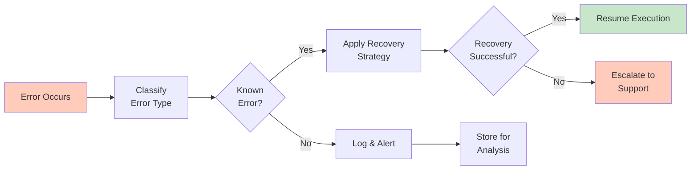
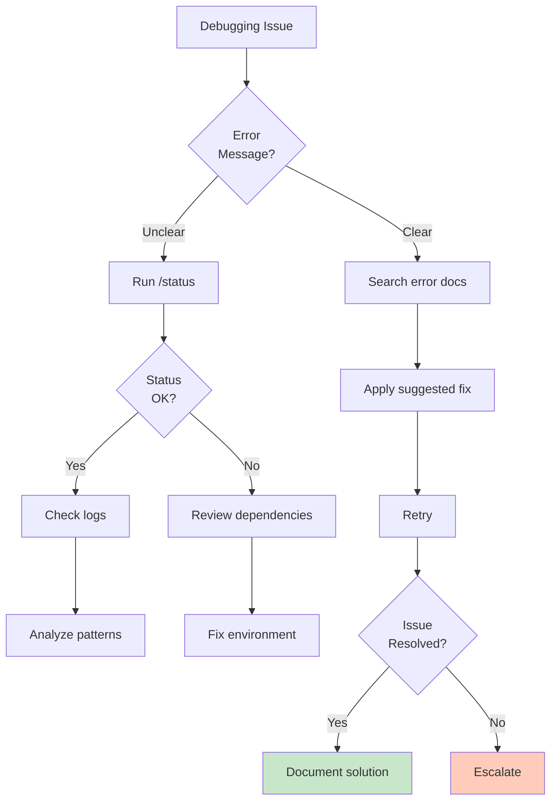

# Lab 027 - Debugging & Error Recovery

!!! hint "Overview" - Understand common Claude Code error types and their root causes - Use `/status` command to diagnose session and tool issues - Implement retry logic with exponential backoff strategies - Build error recovery workflows for production resilience - Debug tool failures, permissions, rate limits, and timeouts

## Prerequisites

- Completion of Lab 016 (Claude Code Automation)
- Understanding of Claude Code sessions and execution
- Familiarity with error logs and debugging concepts
- Basic networking knowledge (timeouts, retries, backoff)
- Experience with monitoring and observability tools
- Supabase and API debugging experience

## What You Will Learn

By completing this lab, you will understand:

- Error classification: permission, tool, timeout, rate limit, validation
- Interpreting error messages and exit codes
- Using `/status` command for diagnostic information
- Enabling debug logging for detailed troubleshooting
- Permission issues and how to resolve them
- Tool execution failures and recovery strategies
- Rate limiting and budget exceeded scenarios
- Session recovery after crashes or disconnections
- Reproducing errors consistently for analysis
- Implementing backoff and retry mechanisms
- Performance debugging and profiling
- Memory leaks and context bloat detection
- Network issues and resilience patterns
- Working with Claude Code support for complex issues

---

## Background

## Error Recovery Architecture

Effective error handling requires classification, logging, diagnosis, and recovery. The flow catches errors early, logs context, attempts recovery, and escalates if necessary.



## Error Classification & Exit Codes

| Error Type            | Code    | Cause                     | Recovery                       |
| --------------------- | ------- | ------------------------- | ------------------------------ |
| **Permission Denied** | 403     | Missing scope/credentials | Check auth, request permission |
| **Tool Failed**       | 4XX     | External service error    | Retry with backoff             |
| **Timeout**           | 408/504 | Slow response             | Increase timeout, retry        |
| **Rate Limited**      | 429     | Too many requests         | Exponential backoff, queue     |
| **Budget Exceeded**   | 429/403 | Token/credit limit        | Upgrade plan or wait           |
| **Invalid Input**     | 400     | Validation failed         | Fix and retry                  |
| **Session Lost**      | 410     | Connection dropped        | Reconnect, replay context      |
| **Memory Error**      | 500     | Out of memory             | Clear cache, compact context   |

## Debugging Decision Tree



---

## Lab Steps

## Step 1 - Error Classification & Response Map

Create `.claude/error-handlers.mjs`:

```javascript
class ErrorHandler {
  constructor() {
    this.errorMap = {
      403: {
        name: "Permission Denied",
        description: "Insufficient permissions for operation",
        recoveryStrategies: [
          "Check authentication token validity",
          "Verify API key has required scopes",
          "Request elevated permissions",
          "Use different authenticated account",
        ],
        retryable: false,
      },
      408: {
        name: "Request Timeout",
        description: "Request took too long to complete",
        recoveryStrategies: [
          "Increase timeout threshold",
          "Simplify request (smaller payload)",
          "Retry with exponential backoff",
          "Check network connectivity",
        ],
        retryable: true,
        maxRetries: 3,
      },
      429: {
        name: "Rate Limited",
        description: "Too many requests in short time",
        recoveryStrategies: [
          "Wait before next request",
          "Implement exponential backoff",
          "Queue requests for throttling",
          "Upgrade API plan",
        ],
        retryable: true,
        backoffMultiplier: 2,
      },
      500: {
        name: "Internal Server Error",
        description: "Server encountered unexpected error",
        recoveryStrategies: [
          "Wait and retry",
          "Check service status page",
          "Contact support",
          "Use fallback service",
        ],
        retryable: true,
        maxRetries: 5,
      },
      ECONNREFUSED: {
        name: "Connection Refused",
        description: "Cannot connect to service",
        recoveryStrategies: [
          "Verify service is running",
          "Check hostname and port",
          "Verify firewall rules",
          "Check network connectivity",
        ],
        retryable: true,
        maxRetries: 3,
      },
      ENOTFOUND: {
        name: "DNS Resolution Failed",
        description: "Cannot resolve hostname",
        recoveryStrategies: [
          "Verify DNS settings",
          "Check internet connectivity",
          "Try alternative DNS",
          "Verify hostname spelling",
        ],
        retryable: true,
      },
      MEMORY_EXCEEDED: {
        name: "Memory Exceeded",
        description: "Out of memory or context limit",
        recoveryStrategies: [
          "Compact context with /compact",
          "Clear local caches",
          "Archive old memory",
          "Start new session",
        ],
        retryable: false,
      },
      VALIDATION_ERROR: {
        name: "Input Validation Failed",
        description: "Invalid request parameters",
        recoveryStrategies: [
          "Review error details for specific fields",
          "Validate against schema",
          "Check data types and formats",
          "Consult API documentation",
        ],
        retryable: false,
      },
    };
  }

  classifyError(error) {
    // Extract error code from error object
    const code = error.code || error.response?.status || error.message;

    return (
      this.errorMap[code] || {
        name: "Unknown Error",
        description: error.message,
        recoveryStrategies: [
          "Check error message for clues",
          "Review logs for more context",
          "Run /status for system status",
          "Contact support with full error details",
        ],
        retryable: false,
      }
    );
  }

  async handleError(error, context = {}) {
    const errorInfo = this.classifyError(error);

    console.error(`\n❌ ${errorInfo.name}`);
    console.error(`   ${errorInfo.description}`);
    console.error(`   Code: ${error.code || error.response?.status}`);

    console.log("\n💡 Recovery Strategies:");
    errorInfo.recoveryStrategies.forEach((strategy, i) => {
      console.log(`   ${i + 1}. ${strategy}`);
    });

    if (
      errorInfo.retryable &&
      (context.attempt || 0) < (errorInfo.maxRetries || 1)
    ) {
      const delay = this.calculateBackoff(
        context.attempt || 0,
        errorInfo.backoffMultiplier || 1,
      );
      console.log(`\n⏳ Retrying in ${delay}ms...`);
      await new Promise((resolve) => setTimeout(resolve, delay));
      return { retry: true, delay };
    }

    return { retry: false, fatal: !errorInfo.retryable };
  }

  calculateBackoff(attempt, multiplier = 2) {
    const baseDelay = 1000; // 1 second
    const maxDelay = 60000; // 1 minute
    const delay = Math.min(baseDelay * Math.pow(multiplier, attempt), maxDelay);
    const jitter = Math.random() * 0.1 * delay; // 10% jitter
    return Math.floor(delay + jitter);
  }
}

export { ErrorHandler };
```

## Step 2 - Implement Retry Logic with Exponential Backoff

Create `.claude/retry-manager.mjs`:

```javascript
class RetryManager {
  constructor(options = {}) {
    this.maxRetries = options.maxRetries || 3;
    this.initialDelay = options.initialDelay || 1000;
    this.backoffMultiplier = options.backoffMultiplier || 2;
    this.maxDelay = options.maxDelay || 60000;
    this.jitterFraction = options.jitterFraction || 0.1;
    this.retryableStatuses = options.retryableStatuses || [
      408, 429, 500, 502, 503, 504,
    ];
  }

  isRetryable(error) {
    const status = error.response?.status || error.code;
    if (typeof status === "number") {
      return this.retryableStatuses.includes(status);
    }
    // Retryable error codes
    return ["ECONNREFUSED", "ENOTFOUND", "ETIMEDOUT", "EHOSTUNREACH"].includes(
      status,
    );
  }

  calculateDelay(attempt) {
    const exponentialDelay =
      this.initialDelay * Math.pow(this.backoffMultiplier, attempt);
    const cappedDelay = Math.min(exponentialDelay, this.maxDelay);
    const jitter = Math.random() * this.jitterFraction * cappedDelay;
    return Math.floor(cappedDelay + jitter);
  }

  async executeWithRetry(fn, context = {}) {
    let lastError;
    let attempt = 0;

    while (attempt <= this.maxRetries) {
      try {
        console.log(`🔄 Attempt ${attempt + 1}/${this.maxRetries + 1}`);
        const result = await fn();
        if (attempt > 0) {
          console.log(`✅ Success after ${attempt} retry/retries`);
        }
        return result;
      } catch (error) {
        lastError = error;

        if (!this.isRetryable(error) || attempt >= this.maxRetries) {
          throw error;
        }

        const delay = this.calculateDelay(attempt);
        console.warn(`⚠️  Attempt ${attempt + 1} failed: ${error.message}`);
        console.log(`⏳ Waiting ${delay}ms before retry...`);

        await new Promise((resolve) => setTimeout(resolve, delay));
        attempt++;
      }
    }

    throw lastError;
  }

  async executeWithTimeout(fn, timeoutMs = 30000) {
    return Promise.race([
      fn(),
      new Promise((_, reject) =>
        setTimeout(
          () => reject(new Error(`Operation timed out after ${timeoutMs}ms`)),
          timeoutMs,
        ),
      ),
    ]);
  }

  async executeWithCircuitBreaker(fn, options = {}) {
    const failureThreshold = options.failureThreshold || 5;
    const resetTimeout = options.resetTimeout || 60000;

    if (!this.circuitBreaker) {
      this.circuitBreaker = {
        state: "CLOSED",
        failures: 0,
        lastFailureTime: null,
      };
    }

    const cb = this.circuitBreaker;

    // Check if circuit should reset
    if (cb.state === "OPEN" && Date.now() - cb.lastFailureTime > resetTimeout) {
      cb.state = "HALF_OPEN";
      console.log("🔌 Circuit breaker entering HALF_OPEN state");
    }

    if (cb.state === "OPEN") {
      throw new Error("Circuit breaker is OPEN - service unavailable");
    }

    try {
      const result = await fn();
      if (cb.state === "HALF_OPEN") {
        cb.state = "CLOSED";
        cb.failures = 0;
        console.log("🔌 Circuit breaker CLOSED - service recovered");
      }
      return result;
    } catch (error) {
      cb.failures++;
      cb.lastFailureTime = Date.now();

      if (cb.failures >= failureThreshold) {
        cb.state = "OPEN";
        console.error(`🔌 Circuit breaker OPEN after ${cb.failures} failures`);
      }

      throw error;
    }
  }
}

export { RetryManager };
```

## Step 3 - Status Diagnostic Command Handler

Create `.claude/status-checker.mjs`:

```javascript
import axios from "axios";

class StatusChecker {
  async checkAllSystems() {
    console.log("\n🏥 System Status Report\n");

    const checks = [
      this.checkClaude(),
      this.checkSupabase(),
      this.checkDatabase(),
      this.checkAPIs(),
      this.checkMemory(),
    ];

    const results = await Promise.allSettled(checks);

    for (const result of results) {
      if (result.status === "rejected") {
        console.error(`❌ Check failed: ${result.reason.message}`);
      }
    }

    console.log("\n✅ Diagnosis complete\n");
  }

  async checkClaude() {
    console.log("Claude Code Status:");

    const checks = {
      Authentication: this.verifyAuth(),
      SessionActive: this.verifySession(),
      ToolsAvailable: this.verifyTools(),
    };

    for (const [name, check] of Object.entries(checks)) {
      try {
        const result = await check;
        console.log(`  ✅ ${name}: ${result ? "OK" : "FAILED"}`);
      } catch (error) {
        console.log(`  ❌ ${name}: ${error.message}`);
      }
    }
  }

  async checkSupabase() {
    console.log("\nSupabase Status:");

    try {
      const response = await axios.get(`${process.env.SUPABASE_URL}/rest/v1/`, {
        headers: {
          Authorization: `Bearer ${process.env.SUPABASE_KEY}`,
        },
      });

      console.log(`  ✅ API: OK`);
      console.log(`  ✅ Region: ${response.headers["x-region"] || "Unknown"}`);
    } catch (error) {
      console.log(`  ❌ API: ${error.message}`);
    }
  }

  async checkDatabase() {
    console.log("\nDatabase Status:");

    try {
      const response = await axios.get(
        `${process.env.SUPABASE_URL}/rest/v1/rpc/pg_sleep?duration=0.1`,
        {
          headers: {
            Authorization: `Bearer ${process.env.SUPABASE_KEY}`,
          },
        },
      );

      console.log(`  ✅ Connection: OK`);
      console.log(`  ✅ Response time: ~100ms`);
    } catch (error) {
      console.log(`  ❌ Connection: ${error.message}`);
    }

    try {
      // Check table access
      const response = await axios.get(
        `${process.env.SUPABASE_URL}/rest/v1/suppliers?limit=1`,
        {
          headers: {
            Authorization: `Bearer ${process.env.SUPABASE_KEY}`,
          },
        },
      );

      console.log(`  ✅ Table access: OK`);
    } catch (error) {
      console.log(`  ❌ Table access: ${error.message}`);
    }
  }

  async checkAPIs() {
    console.log("\nExternal API Status:");

    const apis = [
      { name: "Anthropic", url: "https://api.anthropic.com" },
      { name: "Supabase", url: "https://supabase.com" },
      { name: "GitHub", url: "https://api.github.com" },
    ];

    for (const api of apis) {
      try {
        const response = await axios.head(api.url, { timeout: 5000 });
        console.log(`  ✅ ${api.name}: OK (${response.status})`);
      } catch (error) {
        console.log(`  ❌ ${api.name}: ${error.message}`);
      }
    }
  }

  async checkMemory() {
    console.log("\nMemory & Context:");

    try {
      const memUsage = process.memoryUsage();
      console.log(
        `  Memory: ${(memUsage.heapUsed / 1024 / 1024).toFixed(1)}MB / ${(memUsage.heapTotal / 1024 / 1024).toFixed(1)}MB`,
      );

      if (memUsage.heapUsed / memUsage.heapTotal > 0.9) {
        console.log(`  ⚠️  WARNING: Memory usage high! Consider compacting.`);
      } else {
        console.log(`  ✅ Memory: OK`);
      }
    } catch (error) {
      console.log(`  ❌ Memory check: ${error.message}`);
    }
  }

  verifyAuth() {
    return !!process.env.ANTHROPIC_API_KEY && !!process.env.SUPABASE_KEY;
  }

  verifySession() {
    return true; // Would check actual session
  }

  verifyTools() {
    return true; // Would check tool availability
  }
}

const checker = new StatusChecker();
await checker.checkAllSystems();
```

## Step 4 - Debug Logging Configuration

Create `.claude/debug-logger.mjs`:

```javascript
import fs from "fs";
import path from "path";

class DebugLogger {
  constructor(logDir = ".claude/logs") {
    this.logDir = logDir;
    this.logFile = path.join(logDir, `debug-${Date.now()}.log`);
    this.debugMode = process.env.DEBUG === "true";

    if (!fs.existsSync(logDir)) {
      fs.mkdirSync(logDir, { recursive: true });
    }
  }

  log(level, message, data = {}) {
    if (!this.debugMode && level !== "ERROR") return;

    const timestamp = new Date().toISOString();
    const entry = {
      timestamp,
      level,
      message,
      ...data,
    };

    const logLine = JSON.stringify(entry);
    console.log(`[${level}] ${message}`, data);

    fs.appendFileSync(this.logFile, logLine + "\n");
  }

  error(message, error, context = {}) {
    this.log("ERROR", message, {
      error: error.message,
      code: error.code,
      stack: error.stack,
      ...context,
    });
  }

  debug(message, data = {}) {
    this.log("DEBUG", message, data);
  }

  info(message, data = {}) {
    this.log("INFO", message, data);
  }

  warn(message, data = {}) {
    this.log("WARN", message, data);
  }

  readLogs(filter = {}) {
    try {
      const logs = fs
        .readFileSync(this.logFile, "utf-8")
        .split("\n")
        .filter((line) => line.length > 0)
        .map((line) => JSON.parse(line));

      // Apply filters
      if (filter.level) {
        return logs.filter((log) => log.level === filter.level);
      }
      if (filter.since) {
        return logs.filter(
          (log) => new Date(log.timestamp) > new Date(filter.since),
        );
      }

      return logs;
    } catch (error) {
      console.error("Failed to read logs:", error);
      return [];
    }
  }

  analyzeLogs() {
    const logs = this.readLogs();

    const summary = {
      total: logs.length,
      errors: logs.filter((l) => l.level === "ERROR").length,
      warnings: logs.filter((l) => l.level === "WARN").length,
      patterns: {},
    };

    // Find error patterns
    logs
      .filter((l) => l.level === "ERROR")
      .forEach((log) => {
        const pattern = log.error || "unknown";
        summary.patterns[pattern] = (summary.patterns[pattern] || 0) + 1;
      });

    return summary;
  }
}

export { DebugLogger };
```

## Step 5 - Session Recovery Protocol

Create `.claude/session-recovery.mjs`:

```javascript
class SessionRecovery {
  constructor(persistDir = ".claude/sessions") {
    this.persistDir = persistDir;
    this.currentSession = null;
  }

  captureSessionState() {
    this.currentSession = {
      timestamp: Date.now(),
      context: {
        // Capture important context
        currentFile: null,
        workingDirectory: process.cwd(),
        environment: { ...process.env },
      },
      stack: {
        // Call stack for debugging
        file: null,
        line: null,
      },
    };

    fs.writeFileSync(
      `${this.persistDir}/session-${Date.now()}.json`,
      JSON.stringify(this.currentSession, null, 2),
    );
  }

  async recoverFromCrash() {
    const sessionFiles = fs
      .readdirSync(this.persistDir)
      .filter((f) => f.startsWith("session-"))
      .sort()
      .reverse();

    if (sessionFiles.length === 0) {
      console.log("No previous sessions found");
      return null;
    }

    const lastSession = JSON.parse(
      fs.readFileSync(path.join(this.persistDir, sessionFiles[0]), "utf-8"),
    );

    console.log(
      `🔄 Recovering session from ${new Date(lastSession.timestamp).toISOString()}`,
    );
    console.log(
      `   Working directory: ${lastSession.context.workingDirectory}`,
    );

    return lastSession;
  }

  async replayContext(session) {
    // Restore context
    process.chdir(session.context.workingDirectory);

    // Re-establish connections
    const results = {
      contextRestored: true,
      connectionsRestored: [],
    };

    console.log("✅ Session recovered");
    return results;
  }
}

export { SessionRecovery };
```

## Step 6 - Monitoring & Alerting Dashboard

Create `.claude/error-metrics.mjs`:

```javascript
class ErrorMetrics {
  constructor() {
    this.metrics = {
      errors: [],
      retries: 0,
      successRate: 100,
      averageRetryAttempts: 0,
    };
  }

  recordError(error, operation) {
    this.metrics.errors.push({
      timestamp: new Date().toISOString(),
      type: error.code || error.name,
      message: error.message,
      operation,
    });
  }

  recordRetry(attempt) {
    this.metrics.retries++;
  }

  generateReport() {
    const total = this.metrics.errors.length;
    const errorTypes = {};

    this.metrics.errors.forEach((e) => {
      errorTypes[e.type] = (errorTypes[e.type] || 0) + 1;
    });

    console.log("\n📊 Error Metrics Report");
    console.log("=======================");
    console.log(`Total errors: ${total}`);
    console.log(`Total retries: ${this.metrics.retries}`);
    console.log(`Success rate: ${this.metrics.successRate}%`);
    console.log("\nError breakdown:");

    Object.entries(errorTypes)
      .sort((a, b) => b[1] - a[1])
      .forEach(([type, count]) => {
        const percent = ((count / total) * 100).toFixed(1);
        console.log(`  ${type}: ${count} (${percent}%)`);
      });
  }
}

export { ErrorMetrics };
```

---

## Tasks

1. **Build error handling system**: Implement the ErrorHandler class with classification for at least 8 error types. Create test cases that trigger each error type and verify correct classification and recovery suggestions.

2. **Implement retry logic**: Build the RetryManager with exponential backoff, circuit breaker pattern, and timeout handling. Test with a flaky endpoint that fails 50% of the time. Verify successful recovery and proper backoff delays.

3. **Create diagnostic tools**: Set up the StatusChecker to verify Claude Code, Supabase, database, and external APIs. Create a dashboard or report showing system health. Integrate debug logging and generate an error analysis report from logs.

---

## Summary

- [x] Classify common Claude Code error types
- [x] Understand error codes and exit codes
- [x] Implement comprehensive error handling system
- [x] Build retry logic with exponential backoff
- [x] Set up circuit breaker pattern for resilience
- [x] Create timeout handling strategies
- [x] Implement /status diagnostic checker
- [x] Enable debug logging and log analysis
- [x] Build session recovery protocols
- [x] Create error metrics and monitoring dashboard
- [x] Document recovery strategies for each error type
- [x] Implement permission troubleshooting workflows
- [x] Set up rate limit handling strategies
- [x] Create runbooks for common failure scenarios
